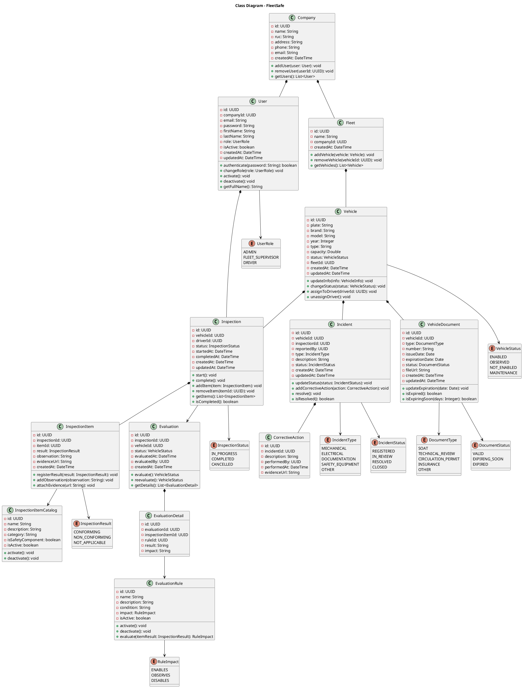
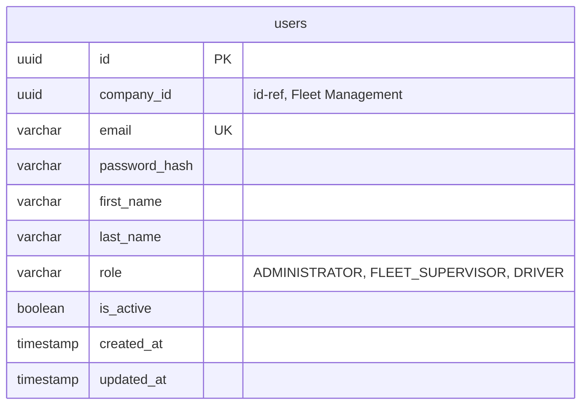
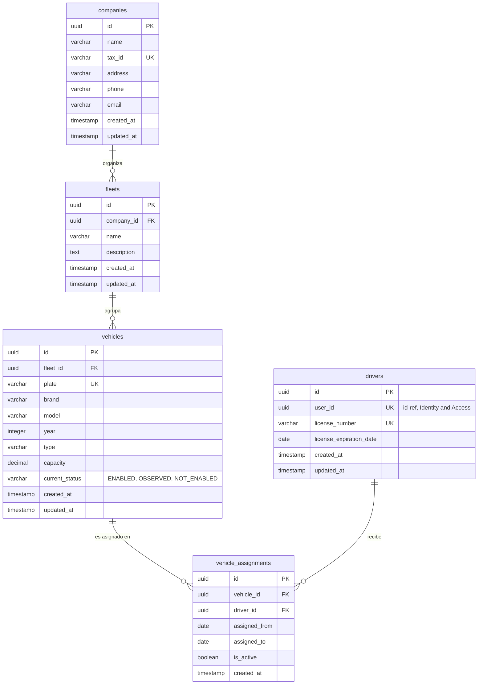
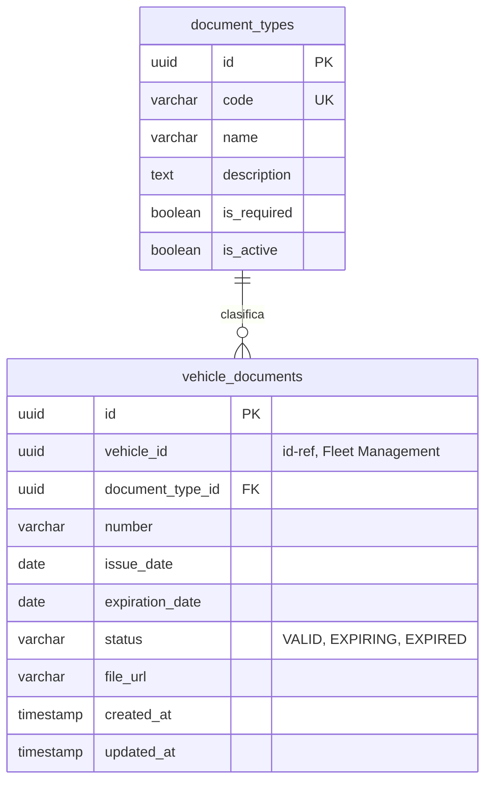
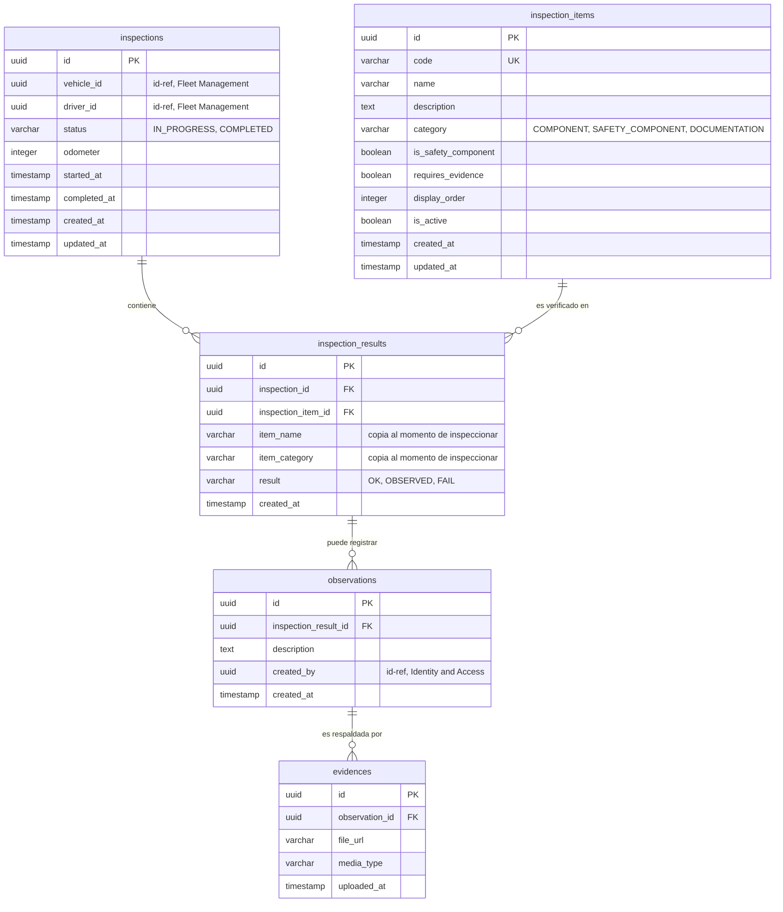
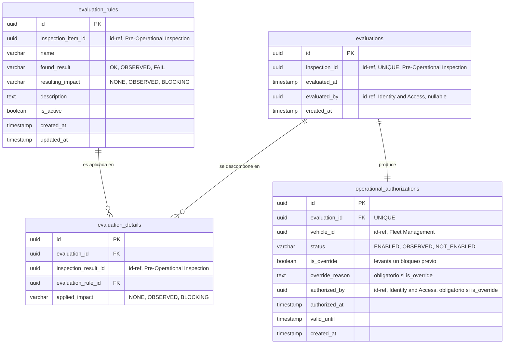
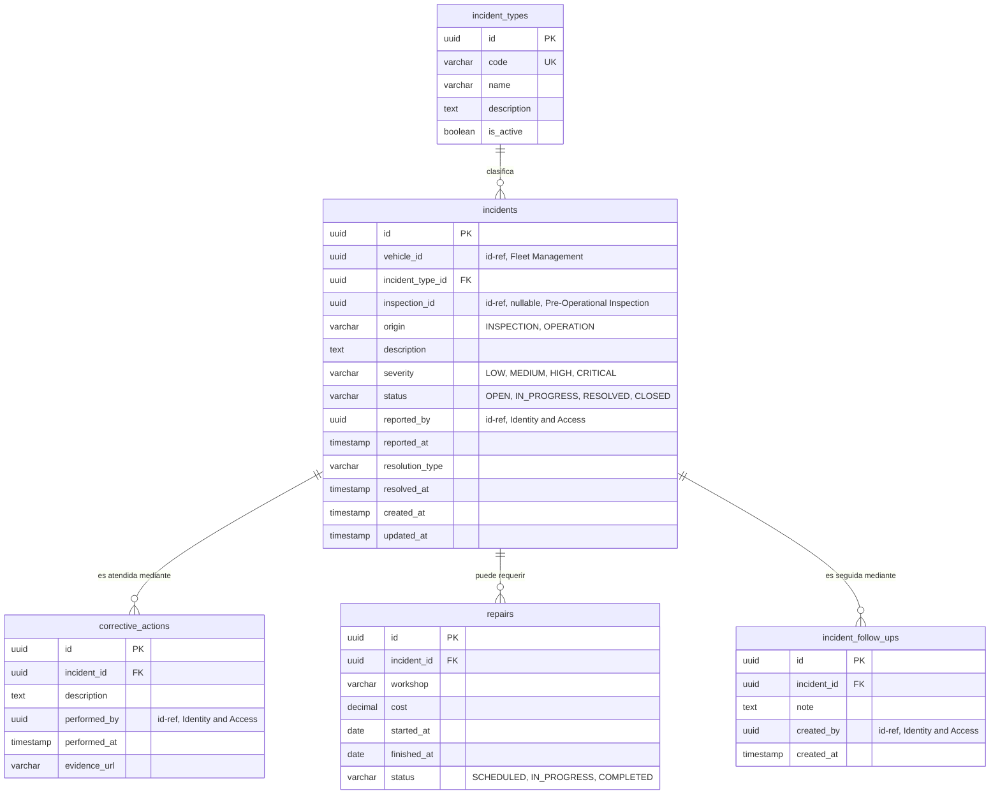

<p align="center">
    
</p>
<h3 align="center">UNIVERSIDAD PERUANA DE CIENCIAS APLICADAS</h3>

<h3 align="center">INGENIERÍA DE SOFTWARE</h3>
<h4 align="center">CICLO 5</h4>
<h4 align="center">1ASI0729 - DESARROLLO DE APLICACIONES OPEN SOURCE</h4>
<h4 align="center"><strong>NRC:</strong> 16692</h4>
<h4 align="center"><strong>PROFESOR:</strong> Angel Augusto Velasquez Nuñez</h4>

<h3 align="center">INFORME DE TRABAJO FINAL</h3>
<h4 align="center"><strong>CICLO:</strong> 2026-20</h4>
<h4 align="center"><strong>STARTUP:</strong> BitMeisters</h4>
<h4 align="center"><strong>PRODUCT:</strong> FleetSafe</h4>

<h4 align="center"><strong>INTEGRANTES:</strong></h4>

<h4 align="center">U20211C201 - Palacin Lazo, Gerardo Valentin</h4>
<h4 align="center">U20221a371 - Santos Torres, Juan Manuel</h4>
<h4 align="center">U20231c197 - Apaza Bocanegra, Elizabeth Noelia</h4>
<h4 align="center">U202318309 - Aguilar Untiveros, Rodrigo Fabrizio</h4>
<h4 align="center">U202122129 - Espino Flores, Alejandro</h4>


<h4 align="center"><i>SETIEMBRE 2026</i></h4>

<hr>

<a id="registro-de-versiones-del-informe"></a>
# **Registro de Versiones del Informe**

| Versión | Fecha | Autor   | Descripción de modificación |
|:--------|:------|:--------|:----------------------------|
| AV1     |       | Gerardo | palabra                     |

<hr>

# **Project Report Collaboration Insights**

<hr>

<a id="contenido"></a>
# **Contenido**

- <a href="#registro-de-versiones-del-informe">Registro de Versiones del Informe</a>

- <a href="#project-report-collaboration-insights">Project Report Collaboration Insights</a>

- <a href="#contenido">Contenido</a>

- <a href="#student-outcome">Student Outcome</a>

- <a href="#capitulo-i-introduccion">Capítulo I: Introducción</a>
    - <a href="#11-startup-profile">1.1. Startup Profile</a>
        - <a href="#111-descripcion-de-la-startup">1.1.1. Descripción de la Startup</a>
        - <a href="#112-perfiles-de-integrantes-del-equipo">1.1.2. Perfiles de integrantes del equipo</a>
    - <a href="#12-solution-profile">1.2. Solution Profile</a>
        - <a href="#121-antecedentes-y-problematica">1.2.1. Antecedentes y problemática</a>
        - <a href="#122-lean-ux-process">1.2.2. Lean UX Process.</a>
            - <a href="#1221-lean-ux-problem-statements">1.2.2.1. Lean UX Problem Statements.</a>
            - <a href="#1222-lean-ux-assumptions">1.2.2.2. Lean UX Assumptions.</a>
            - <a href="#1223-lean-ux-hypothesis-statements">1.2.2.3. Lean UX Hypothesis Statements.</a>
            - <a href="#1224-lean-ux-canvas">1.2.2.4. Lean UX Canvas.</a>
    - <a href="#13-segmentos-objetivo">1.3. Segmentos objetivo.</a>

- <a href="#capitulo-ii-requirements-elicitation-analysis">Capítulo II: Requirements Elicitation & Analysis</a>
    - <a href="#21-competidores">2.1. Competidores.</a>
        - <a href="#211-analisis-competitivo">2.1.1. Análisis competitivo.</a>
        - <a href="#212-estrategias-y-tacticas-frente-a-competidores">2.1.2. Estrategias y tácticas frente a competidores.</a>
    - <a href="#22-entrevistas">2.2. Entrevistas.</a>
        - <a href="#221-diseno-de-entrevistas">2.2.1. Diseño de entrevistas.</a>
        - <a href="#222-registro-de-entrevistas">2.2.2. Registro de entrevistas.</a>
        - <a href="#223-analisis-de-entrevistas">2.2.3. Análisis de entrevistas.</a>
    - <a href="#23-needfinding">2.3. Needfinding.</a>
        - <a href="#231-user-personas">2.3.1. User Personas.</a>
        - <a href="#232-user-task-matrix">2.3.2. User Task Matrix.</a>
        - <a href="#233-user-journey-mapping">2.3.3. User Journey Mapping.</a>
        - <a href="#234-empathy-mapping">2.3.4. Empathy Mapping.</a>
    - <a href="#24-big-picture-eventstorming">2.4. Big Picture EventStorming.</a>
    - <a href="#25-ubiquitous-language">2.5. Ubiquitous Language.</a>

- <a href="#capitulo-iii-requirements-specification">Capítulo III: Requirements Specification</a>
    - <a href="#31-user-stories">3.1. User Stories.</a>
    - <a href="#32-impact-mapping">3.2. Impact Mapping.</a>
    - <a href="#33-product-backlog">3.3. Product Backlog.</a>

- <a href="#capitulo-iv-product-design">Capítulo IV: Product Design</a>
    - <a href="#41-style-guidelines">4.1. Style Guidelines.</a>
        - <a href="#411-general-style-guidelines">4.1.1. General Style Guidelines.</a>
        - <a href="#412-web-style-guidelines">4.1.2. Web Style Guidelines.</a>
    - <a href="#42-information-architecture">4.2. Information Architecture.</a>
        - <a href="#421-organization-systems">4.2.1. Organization Systems.</a>
        - <a href="#422-labeling-systems">4.2.2. Labeling Systems.</a>
        - <a href="#423-seo-tags-and-meta-tags">4.2.3. SEO Tags and Meta Tags.</a>
        - <a href="#424-searching-systems">4.2.4. Searching Systems.</a>
        - <a href="#425-navigation-systems">4.2.5. Navigation Systems.</a>
    - <a href="#43-landing-page-ui-design">4.3. Landing Page UI Design.</a>
        - <a href="#431-landing-page-wireframe">4.3.1. Landing Page Wireframe.</a>
        - <a href="#432-landing-page-mock-up">4.3.2. Landing Page Mock-up.</a>
    - <a href="#44-web-applications-uxui-design">4.4. Web Applications UX/UI Design.</a>
        - <a href="#441-web-applications-wireframes">4.4.1. Web Applications Wireframes.</a>
        - <a href="#442-web-applications-wireflow-diagrams">4.4.2. Web Applications Wireflow Diagrams.</a>
        - <a href="#443-web-applications-mock-ups">4.4.3. Web Applications Mock-ups.</a>
        - <a href="#444-web-applications-user-flow-diagrams">4.4.4. Web Applications User Flow Diagrams.</a>
    - <a href="#45-web-applications-prototyping">4.5. Web Applications Prototyping.</a>
    - <a href="#46-domain-driven-software-architecture">4.6. Domain-Driven Software Architecture.</a>
        - <a href="#461-design-level-event-storming">4.6.1. Design-level Event Storming.</a>
        - <a href="#462-software-architecture-context-diagram">4.6.2. Software Architecture Context Diagram.</a>
        - <a href="#463-software-architecture-container-diagrams">4.6.3. Software Architecture Container Diagrams.</a>
        - <a href="#464-software-architecture-components-diagrams">4.6.4. Software Architecture Components Diagrams.</a>
    - <a href="#47-software-object-oriented-design">4.7. Software Object-Oriented Design.</a>
        - <a href="#471-class-diagrams">4.7.1. Class Diagrams.</a>
    - <a href="#48-database-design">4.8. Database Design.</a>
        - <a href="#481-database-diagrams">4.8.1. Database Diagrams.</a>

- <a href="#capitulo-v-product-implementation-validation-deployment">Capítulo V: Product Implementation, Validation & Deployment</a>
    - <a href="#51-software-configuration-management">5.1. Software Configuration Management.</a>
        - <a href="#511-software-development-environment-configuration">5.1.1. Software Development Environment Configuration.</a>
        - <a href="#512-source-code-management">5.1.2. Source Code Management.</a>
        - <a href="#513-source-code-style-guide-and-conventions">5.1.3. Source Code Style Guide and Conventions.</a>
        - <a href="#514-software-deployment-configuration">5.1.4. Software Deployment Configuration.</a>
    - <a href="#52-landing-page-services-applications-implementation">5.2. Landing Page, Services & Applications Implementation.</a>
        - <a href="#52x-sprint-n">5.2.x. Sprint n</a>
            - <a href="#52x1-sprint-planning-n">5.2.x.1. Sprint Planning n.</a>
            - <a href="#52x2-aspect-leader-and-colaborators">5.2.x.2. Aspect Leader and Colaborators.</a>
            - <a href="#52x3-sprint-backlog-n">5.2.x.3. Sprint Backlog n.</a>
            - <a href="#52x4-development-evidence-for-sprint-review">5.2.x.4. Development Evidence for Sprint Review.</a>
            - <a href="#52x5-execution-evidence-for-sprint-review">5.2.x.5. Execution Evidence for Sprint Review.</a>
            - <a href="#52x6-services-documentation-evidence-for-sprint-review">5.2.x.6. Services Documentation Evidence for Sprint Review.</a>
            - <a href="#52x7-software-deployment-evidence-for-sprint-review">5.2.x.7. Software Deployment Evidence for Sprint Review.</a>
            - <a href="#52x8-team-colaboration-insights-during-sprint">5.2.x.8. Team Colaboration Insights during Sprint.</a>
    - <a href="#53-validation-interviews">5.3. Validation Interviews.</a>
        - <a href="#531-diseno-de-entrevistas">5.3.1. Diseño de Entrevistas.</a>
        - <a href="#532-registro-de-entrevistas">5.3.2. Registro de Entrevistas.</a>
        - <a href="#533-evaluaciones-segun-heuristicas">5.3.3. Evaluaciones según heurísticas.</a>
    - <a href="#54-video-about-the-product">5.4. Video About-the-Product.</a>

- <a href="#conclusiones">Conclusiones</a>
    - <a href="#conclusiones-y-recomendaciones">Conclusiones y recomendaciones.</a>
    - <a href="#video-about-the-team">Video About-the-Team.</a>

- <a href="#bibliografia">Bibliografía</a>

- <a href="#anexos">Anexos</a>

<hr>


<a id="student-outcome"></a>
# **Student Outcome**

El curso contribuye al cumplimiento del Student Outcome ABET:

**ABET – EAC - Student Outcome 3**

Criterio: Capacidad de comunicarse efectivamente con
un rango de audiencias.

En el siguiente cuadro se describe las acciones realizadas y enunciados de conclusiones por parte del grupo, que permiten sustentar el haber alcanzado el logro del ABET – EAC - Student Outcome 3.

| Criterio específico                                                   | Acciones realizadas                                                                                                                                                                                                                                                                                                                                                                                                                                                                              | Conclusiones                                                                                                                                                                                                                                                                                                                                                                                                                                                                                                                                       |
|:----------------------------------------------------------------------|:-------------------------------------------------------------------------------------------------------------------------------------------------------------------------------------------------------------------------------------------------------------------------------------------------------------------------------------------------------------------------------------------------------------------------------------------------------------------------------------------------|:---------------------------------------------------------------------------------------------------------------------------------------------------------------------------------------------------------------------------------------------------------------------------------------------------------------------------------------------------------------------------------------------------------------------------------------------------------------------------------------------------------------------------------------------------|
| Comunica oralmente con efectividad a diferentes rangos de audiencia   | **Rodrigo Fabricio, Aguilar Untiveros**<br>_AV1_<br>_Pendiente de completar por el integrante._<br><br>**Elizabeth Noelia, Apaza Bocanegra**<br>_AV1_<br>_Pendiente de completar por el integrante._<br><br>**Palacin Lazo, Gerardo Valentin**<br>_AV1_<br>_Pendiente de completar por el integrante._<br><br>**Alejandro Espino, Flores**<br>_AV1_<br>_Pendiente de completar por la integrante._<br><br>**Juan Manuel, Santos Torres**<br>_AV1_<br>_Pendiente de completar por la integrante._ | _AV1_<br>El equipo organizó el desarrollo de FleetSafe considerando diferentes responsabilidades relacionadas con la definición de la solución, el análisis del problema y el desarrollo de la plataforma.<br>La propuesta establece una estructura compuesta por Landing Page, Web Application y Backend RESTful API, permitiendo distribuir las actividades necesarias para construir la solución.<br>El equipo mantuvo como objetivo común desarrollar una plataforma orientada al control preventivo y la habilitación operativa de vehículos. |
| Comunica por escrito con efectividad a diferentes rangos de audiencia | **Rodrigo Fabricio, Aguilar Untiveros**<br>_AV1_<br>_Pendiente de completar por el integrante._<br><br>**Elizabeth Noelia, Apaza Bocanegra**<br>_AV1_<br>_Pendiente de completar por el integrante._<br><br>**Palacin Lazo, Gerardo Valentin**<br>_AV1_<br>_Pendiente de completar por el integrante._<br><br>**Alejandro Espino, Flores**<br>_AV1_<br>_Pendiente de completar por la integrante._<br><br>**Juan Manuel, Santos Torres**<br>_AV1_<br>_Pendiente de completar por la integrante._  | _AV1_<br>El equipo estableció como eje principal de FleetSafe el flujo de inspección, validación, evaluación, identificación de riesgos, habilitación y seguimiento.<br>La definición de tres roles principales —Administrador, Supervisor de flota y Conductor— permitió organizar las responsabilidades dentro de la aplicación.<br>El enfoque del proyecto permite que el conductor realice la inspección, el sistema evalúe las condiciones, el supervisor controle los resultados y las incidencias sean atendidas.                           |

<hr>


<a id="capitulo-i-introduccion"></a>
# Capítulo I: Introducción

<a id="11-startup-profile"></a>
## 1.1. Startup Profile

<a id="111-descripcion-de-la-startup"></a>
### 1.1.1. Descripción de la Startup

**FleetSafe** es una plataforma web de seguridad y control preventivo vehicular dirigida a empresas que operan vehículos de transporte de carga y necesitan verificar y controlar las condiciones de seguridad de sus unidades antes de iniciar una operación.

La plataforma permite que los conductores realicen **inspecciones preoperacionales digitales** sobre los vehículos asignados, registrando el estado de componentes, elementos de seguridad, documentación y observaciones.

A partir de los resultados obtenidos y de las reglas establecidas por la empresa, FleetSafe evalúa la condición del vehículo y determina si este se encuentra **habilitado, observado o no habilitado para operar**.

La plataforma está compuesta por:

- **Landing Page**
- **Web Application**
- **Backend RESTful API**

La Web Application manejará principalmente tres roles:

- **Administrador**
- **Supervisor de flota**
- **Conductor**

#### Misión

Desarrollar una plataforma web que permita a las empresas de transporte de carga controlar preventivamente las condiciones de seguridad de sus vehículos, mediante inspecciones preoperacionales digitales, evaluación de resultados, identificación de riesgos y seguimiento de incidencias.

#### Visión

Consolidar FleetSafe como una solución orientada al control preventivo y la habilitación operativa de vehículos de transporte de carga, facilitando que las empresas puedan verificar las condiciones de sus unidades antes de iniciar una operación y mantener un historial de su estado.

#### Modelo de Negocio

La propuesta inicial de FleetSafe no especifica un modelo de negocio, modalidad de suscripción ni estructura de precios. Por ello, estos aspectos quedan **pendientes de definición** y validación durante el desarrollo del proyecto.

#### Público Objetivo Principal

FleetSafe está dirigido principalmente a los siguientes segmentos:

- **Empresas de transporte de carga:** empresas que utilizan una flota de vehículos y necesitan controlar su condición de seguridad, documentación y mantenimiento preventivo.
- **Supervisores de flota:** responsables de revisar el estado de los vehículos, consultar las inspecciones realizadas, gestionar incidencias y verificar qué unidades se encuentran habilitadas para operar.
- **Conductores de vehículos de carga:** usuarios que realizan las inspecciones preoperacionales de los vehículos asignados y registran observaciones o evidencias cuando detectan problemas.

El principal valor de FleetSafe consiste en centralizar el control preventivo de los vehículos y permitir que, a partir de una inspección, el sistema evalúe su condición y determine si se encuentra habilitado, observado o no habilitado para operar.

FleetSafe no tiene como objetivo principal gestionar rutas, puntos de entrega o entregas de mercadería. Su responsabilidad se concentra principalmente en determinar y mantener la condición preventiva del vehículo antes y durante su ciclo de control.

---

<a id="112-perfiles-de-integrantes-del-equipo"></a>
### 1.1.2. Perfiles de integrantes del equipo

A continuación se presenta la ficha de cada integrante del equipo, indicando su código de estudiante, la carrera que cursa y un resumen de los principales conocimientos técnicos y habilidades que aporta al equipo.

| **Integrante**            | Palacin Lazo, Gerardo Valentin                                                                                  |
| :------------------------ |:----------------------------------------------------------------------------------------------------------------|
| **Código del Estudiante** | U20211C201                                                                                                      |
| **Carrera**               | Ingeniería de Software                                                                                          |
| **Descripción**            | _Pendiente de redacción por el integrante._                                                                     |
| **Foto**                  |  |

---

| **Integrante**            | Rodrigo Fabrizio Aguilar Untiveros                                                                                |
|:--------------------------|:------------------------------------------------------------------------------------------------------------------|
| **Código del Estudiante** | U202318309                                                                                                        |
| **Carrera**               | Ingeniería de Software                                                                                            |
| **Descripción**           | _Pendiente de redacción por el integrante._                                                                       |
| **Foto**                  |  |

---

| **Integrante**            | Elizabeth Noelia Apaza Bocanegra                                                                                  |
|:--------------------------|:------------------------------------------------------------------------------------------------------------------|
| **Código del Estudiante** | U20231c197                                                                                                        |
| **Carrera**               | Ingeniería de Software                                                                                            |
| **Descripción**           | _Pendiente de redacción por el integrante._                                                                       |
| **Foto**                  |  |

---

| **Integrante**            | Alejandro Espino Flores                                                                                  |
|:--------------------------|:---------------------------------------------------------------------------------------------------------|
| **Código del Estudiante** | U202122129                                                                                               |
| **Carrera**               | Ingeniería de Software                                                                                   |
| **Descripción**           | _Pendiente de redacción por la integrante._                                                              |
| **Foto**                  |  |

---

| **Integrante**            | Juan Manuel Santos Torres                                                                               |
|:--------------------------|:--------------------------------------------------------------------------------------------------------|
| **Código del Estudiante** | U20221a371                                                                                              |
| **Carrera**               | Ingeniería de Software                                                                                  |
| **Descripción**           | _Pendiente de redacción por la integrante._                                                             |
| **Foto**                  |  |

---

<a id="12-solution-profile"></a>
## 1.2. Solution Profile

**FleetSafe** es una plataforma web de seguridad y control preventivo vehicular desarrollada para empresas que operan vehículos de transporte de carga y necesitan verificar y controlar las condiciones de seguridad de sus unidades antes de iniciar una operación.

La solución permite realizar inspecciones preoperacionales digitales sobre los vehículos asignados, registrando el estado de componentes, elementos de seguridad, documentación y observaciones.

A partir de los resultados de la inspección y de las reglas establecidas por la empresa, FleetSafe evalúa la condición del vehículo y determina si se encuentra **habilitado, observado o no habilitado para operar**.

El núcleo de FleetSafe se encuentra en el siguiente flujo:

**Inspección → validación → evaluación → identificación de riesgos → habilitación → seguimiento.**

La pregunta principal que responde FleetSafe es:

> **¿Este vehículo cumple las condiciones necesarias para operar?**

FleetSafe no tiene como objetivo principal gestionar rutas, puntos de entrega o entregas de mercadería. Su responsabilidad termina principalmente en determinar y mantener la condición preventiva del vehículo antes y durante su ciclo de control.

---

<a id="121-antecedentes-y-problematica"></a>
### 1.2.1. Antecedentes y problemática

Las empresas de transporte de carga necesitan verificar y controlar las condiciones de seguridad de sus vehículos antes de iniciar una operación.

Actualmente, estos controles preventivos pueden realizarse mediante **formatos físicos, hojas de cálculo o procesos dispersos**, lo que dificulta disponer de una visión centralizada y actualizada sobre la condición de las unidades.

Esta situación dificulta conocer rápidamente:

- Qué vehículos fueron inspeccionados.
- Qué problemas fueron detectados.
- Qué unidades presentan riesgos.
- Qué documentos están próximos a vencer.
- Qué incidencias continúan pendientes.
- Qué vehículos requieren atención.
- Qué unidades cumplen las condiciones para operar.

FleetSafe busca centralizar esta información y permitir la toma de decisiones preventivas antes de iniciar una operación.

#### Análisis 5W + 2H

| Pregunta                                   | Descripción                                                                                                                                                                                                            |
|--------------------------------------------|------------------------------------------------------------------------------------------------------------------------------------------------------------------------------------------------------------------------|
| **Who - ¿Quiénes están involucrados?**     | Empresas de transporte de carga, supervisores de flota y conductores de vehículos de carga.                                                                                                                            |
| **What - ¿Cuál es el problema?**           | Las empresas pueden tener dificultades para controlar de manera centralizada las condiciones de seguridad, documentación, inspecciones e incidencias de sus vehículos.                                                 |
| **Where - ¿Dónde ocurre?**                 | En el proceso de control preventivo de los vehículos de transporte de carga, principalmente antes de iniciar una operación.                                                                                            |
| **When - ¿Cuándo ocurre?**                 | Durante las inspecciones preoperacionales y el seguimiento posterior de las condiciones e incidencias de los vehículos.                                                                                                |
| **Why - ¿Por qué representa un problema?** | Porque el uso de formatos físicos, hojas de cálculo o procesos dispersos dificulta conocer rápidamente el estado preventivo de las unidades y determinar cuáles cumplen las condiciones necesarias para operar.        |
| **How - ¿Cómo se presenta el problema?**   | Mediante información distribuida entre diferentes formatos o procesos, dificultando la consulta de inspecciones, problemas detectados, riesgos, documentos próximos a vencer e incidencias pendientes.                 |
| **How Much - ¿Cuál es su impacto?**        | La propuesta inicial no establece una medida cuantitativa del impacto. Sin embargo, identifica dificultades para conocer rápidamente el estado de los vehículos y tomar decisiones preventivas antes de una operación. |

#### Enunciado del problema

Las empresas de transporte de carga necesitan verificar y controlar las condiciones de seguridad de sus vehículos antes de iniciar una operación. Sin embargo, cuando estos controles se realizan mediante formatos físicos, hojas de cálculo o procesos dispersos, resulta difícil conocer rápidamente qué vehículos fueron inspeccionados, qué problemas fueron detectados, qué unidades presentan riesgos y cuáles cumplen las condiciones necesarias para operar.

Los conductores necesitan realizar inspecciones preoperacionales sobre los vehículos asignados y registrar observaciones o evidencias cuando detectan problemas.

Los supervisores de flota necesitan consultar las inspecciones realizadas, revisar el estado de los vehículos, gestionar incidencias y verificar qué unidades se encuentran habilitadas para operar.

Esta situación genera la oportunidad de desarrollar una plataforma que centralice la información del control preventivo y permita evaluar la condición de los vehículos antes de iniciar una operación.

#### Puntos principales que debe resolver la solución

FleetSafe buscará abordar principalmente los siguientes puntos:

- Centralizar la información relacionada con las inspecciones preoperacionales.
- Registrar el estado de componentes y elementos de seguridad.
- Registrar documentación y observaciones relacionadas con los vehículos.
- Evaluar los resultados de las inspecciones mediante reglas establecidas por la empresa.
- Identificar los riesgos o problemas detectados durante las inspecciones.
- Determinar si un vehículo se encuentra habilitado, observado o no habilitado para operar.
- Registrar y realizar seguimiento de incidencias.
- Mantener un historial del estado preventivo de los vehículos.

#### Objetivos de la solución

- Permitir que los conductores realicen inspecciones preoperacionales digitales de los vehículos asignados.
- Registrar el estado de componentes, elementos de seguridad, documentación y observaciones.
- Evaluar los resultados de las inspecciones de acuerdo con las reglas establecidas por la empresa.
- Determinar la condición preventiva del vehículo.
- Facilitar a los supervisores la consulta de las inspecciones realizadas.
- Permitir gestionar y realizar seguimiento de las incidencias detectadas.
- Facilitar la identificación de las unidades habilitadas, observadas y no habilitadas para operar.
- Mantener un historial relacionado con el control preventivo de los vehículos.

#### Restricciones iniciales

Para mantener el enfoque definido para FleetSafe, se consideran inicialmente las siguientes restricciones:

- FleetSafe estará orientado principalmente a **vehículos de transporte de carga**.
- La solución será desarrollada como una **plataforma web**.
- La aplicación contará principalmente con los roles de **Administrador, Supervisor de flota y Conductor**.
- El sistema se centrará en el **control preventivo y la habilitación operativa de vehículos**.
- La gestión de rutas, puntos de entrega y entregas de mercadería no forma parte del objetivo principal de FleetSafe.
- La determinación de la condición del vehículo se realizará a partir de los resultados de las inspecciones y las reglas establecidas por la empresa.

---

<a id="122-lean-ux-process"></a>
### 1.2.2. Lean UX Process

FleetSafe aplicará el enfoque Lean UX para identificar y validar las principales suposiciones relacionadas con el control preventivo y la habilitación operativa de vehículos de transporte de carga.

Durante esta etapa se considerarán las necesidades de las empresas de transporte de carga, supervisores de flota y conductores, así como las funcionalidades relacionadas con las inspecciones preoperacionales, evaluación de condiciones, identificación de riesgos, habilitación e incidencias.

Las suposiciones deberán ser posteriormente contrastadas mediante investigación con los segmentos objetivo y mediante la evolución progresiva de la solución.

<a id="1221-lean-ux-problem-statements"></a>
#### 1.2.2.1. Lean UX Problem Statements

FleetSafe corresponde a una iniciativa orientada a resolver problemas relacionados con el control preventivo de vehículos de transporte de carga.

##### Problem Statement

Las empresas de transporte de carga necesitan controlar las condiciones de seguridad de sus vehículos antes de iniciar una operación.

Los procesos basados en formatos físicos, hojas de cálculo o información dispersa dificultan conocer rápidamente el resultado de las inspecciones, los problemas detectados, los riesgos existentes, la documentación próxima a vencer y las incidencias pendientes.

FleetSafe busca abordar esta situación mediante una plataforma web que permita realizar inspecciones preoperacionales digitales, registrar sus resultados, evaluar las condiciones del vehículo y determinar si se encuentra habilitado, observado o no habilitado para operar.

Nuestro enfoque inicial estará dirigido principalmente a las **empresas de transporte de carga, supervisores de flota y conductores de vehículos de carga**.

Consideraremos que FleetSafe está generando valor cuando los usuarios puedan realizar y consultar inspecciones, identificar problemas y riesgos, gestionar incidencias y conocer la condición preventiva de un vehículo mediante una única plataforma.

<a id="1222-lean-ux-assumptions"></a>
#### 1.2.2.2. Lean UX Assumptions

Las siguientes assumptions representan las creencias iniciales relacionadas con FleetSafe y deberán ser validadas mediante investigación con los segmentos objetivo.

##### Business Assumptions

- Creemos que las empresas de transporte de carga necesitan mejorar el control preventivo de sus vehículos.
- Creemos que centralizar la información de las inspecciones puede facilitar la supervisión de la condición de las unidades.
- Creemos que una plataforma especializada en control preventivo vehicular puede facilitar la toma de decisiones antes de iniciar una operación.
- Creemos que las empresas necesitan conocer qué unidades se encuentran habilitadas para operar.
- Creemos que centralizar la información de incidencias puede facilitar su seguimiento y atención.

##### Business Outcome Assumptions

- Creemos que FleetSafe puede reducir la dificultad para conocer el estado preventivo de los vehículos.
- Creemos que la plataforma puede facilitar la identificación de unidades que presentan riesgos.
- Creemos que centralizar las inspecciones puede facilitar la consulta de información histórica.
- Creemos que una evaluación basada en reglas puede facilitar la determinación de la condición de los vehículos.
- Creemos que una mayor disponibilidad de información puede facilitar la toma de decisiones preventivas.

##### User Assumptions

- Creemos que los supervisores de flota necesitan conocer el estado de los vehículos bajo su responsabilidad.
- Creemos que los conductores necesitan realizar inspecciones preoperacionales de los vehículos asignados.
- Creemos que los conductores necesitan registrar observaciones o evidencias cuando detectan problemas.
- Creemos que los supervisores necesitan consultar las inspecciones realizadas.
- Creemos que los supervisores necesitan gestionar las incidencias detectadas.
- Creemos que los usuarios necesitan conocer si una unidad está habilitada, observada o no habilitada para operar.

##### User Outcome and Benefit Assumptions

- Creemos que los supervisores desean identificar rápidamente qué vehículos cumplen las condiciones para operar.
- Creemos que los supervisores desean identificar qué unidades presentan riesgos o problemas.
- Creemos que los conductores desean realizar una inspección sin depender de formatos físicos.
- Creemos que los conductores desean registrar observaciones o evidencias cuando detectan problemas.
- Creemos que los supervisores desean consultar el historial de inspecciones de los vehículos.
- Creemos que las empresas desean mantener un registro organizado del estado preventivo de sus unidades.

##### Feature Assumptions

- Creemos que un **módulo de gestión de vehículos y usuarios** permitirá organizar las unidades y usuarios que forman parte del sistema.
- Creemos que un **módulo de inspección preoperacional** permitirá a los conductores registrar el estado de los vehículos asignados.
- Creemos que una **funcionalidad de evaluación basada en reglas** permitirá determinar la condición preventiva del vehículo.
- Creemos que una **funcionalidad de habilitación operativa** permitirá identificar vehículos habilitados, observados y no habilitados.
- Creemos que un **módulo de incidencias** permitirá registrar y realizar seguimiento de los problemas detectados.
- Creemos que una **funcionalidad de historial** permitirá consultar información relacionada con el control preventivo de los vehículos.

<a id="1223-lean-ux-hypothesis-statements"></a>
#### 1.2.2.3. Lean UX Hypothesis Statements

Los siguientes Hypothesis Statements se derivan de las funcionalidades y necesidades identificadas para FleetSafe.

##### Hypothesis Statement 1 - Inspección preoperacional

Creemos que lograremos **mejorar el control preventivo de los vehículos** si los **conductores** logran **realizar inspecciones digitales de los vehículos asignados y registrar el estado de sus componentes, elementos de seguridad, documentación y observaciones** mediante una **funcionalidad de inspección preoperacional**.

##### Hypothesis Statement 2 - Evaluación del vehículo

Creemos que lograremos **facilitar la identificación de riesgos y problemas en los vehículos** si el **sistema** logra **evaluar los resultados de las inspecciones de acuerdo con las reglas establecidas por la empresa** mediante una **funcionalidad de evaluación basada en reglas**.

##### Hypothesis Statement 3 - Habilitación operativa

Creemos que lograremos **facilitar la toma de decisiones sobre la operación de los vehículos** si los **supervisores de flota** logran **conocer qué unidades están habilitadas, observadas o no habilitadas para operar** mediante una **funcionalidad de habilitación operativa**.

##### Hypothesis Statement 4 - Gestión de incidencias

Creemos que lograremos **mejorar el seguimiento de los problemas detectados en los vehículos** si los **conductores y supervisores** logran **registrar, consultar y realizar seguimiento de las incidencias** mediante un **módulo de gestión de incidencias**.

##### Hypothesis Statement 5 - Control del supervisor

Creemos que lograremos **mejorar la supervisión de la condición preventiva de los vehículos** si los **supervisores de flota** logran **consultar las inspecciones realizadas, identificar riesgos y verificar el estado de las unidades** mediante las funcionalidades de **consulta y control de FleetSafe**.

##### Hypothesis Statement 6 - Historial de control preventivo

Creemos que lograremos **mejorar la disponibilidad de información sobre las condiciones de los vehículos** si los **supervisores** logran **consultar el historial de inspecciones, incidencias y evaluaciones realizadas** mediante una **funcionalidad de historial**.

<a id="1224-lean-ux-canvas"></a>
#### <i>**1.2.2.4. Lean UX Canvas.**</i>

_Pendiente de completar con el Lean UX Canvas de FleetSafe._

<hr>


<a id="13-segmentos-objetivo"></a>
## 1.3. Segmentos objetivo

Los segmentos objetivo de FleetSafe se encuentran relacionados con las actividades de control preventivo y seguridad de los vehículos de transporte de carga.

La definición presentada en esta etapa corresponde a la información inicial establecida para FleetSafe. Las características específicas, comportamientos y necesidades de cada segmento deberán ser posteriormente validadas mediante investigación.

Los segmentos considerados inicialmente son las **empresas de transporte de carga**, los **supervisores de flota** y los **conductores de vehículos de carga**.

### Empresas de transporte de carga

Las empresas de transporte de carga constituyen el segmento organizacional al que se dirige principalmente FleetSafe.

Estas empresas utilizan una flota de vehículos y necesitan controlar su condición de seguridad, documentación y mantenimiento preventivo.

#### Características generales

- Empresas que operan vehículos de transporte de carga.
- Utilizan una flota de vehículos.
- Necesitan controlar la condición de seguridad de sus unidades.
- Necesitan controlar documentación relacionada con sus vehículos.
- Requieren realizar controles preventivos antes de iniciar operaciones.

#### Necesidades iniciales identificadas

- Controlar la condición de seguridad de los vehículos.
- Centralizar la información relacionada con las inspecciones.
- Conocer qué unidades presentan riesgos.
- Identificar qué vehículos requieren atención.
- Conocer qué unidades cumplen las condiciones para operar.

---

### Supervisores de flota

Los supervisores de flota representan uno de los principales usuarios de FleetSafe.

Son responsables de revisar el estado de los vehículos, consultar las inspecciones realizadas, gestionar incidencias y verificar qué unidades se encuentran habilitadas para operar.

#### Características del segmento

- Revisan el estado de los vehículos.
- Consultan las inspecciones realizadas.
- Gestionan incidencias.
- Verifican qué unidades se encuentran habilitadas para operar.
- Necesitan información sobre los riesgos y problemas detectados.

#### Necesidades iniciales identificadas

- Revisar las inspecciones realizadas.
- Conocer el estado de los vehículos.
- Identificar unidades que presentan riesgos.
- Gestionar incidencias.
- Verificar qué vehículos se encuentran habilitados para operar.

---

### Conductores de vehículos de carga

Los conductores de vehículos de carga constituyen uno de los principales usuarios operativos de FleetSafe.

Son los usuarios que realizan las inspecciones preoperacionales de los vehículos asignados y registran observaciones o evidencias cuando detectan problemas.

#### Características del segmento

- Operan vehículos de transporte de carga.
- Reciben vehículos asignados para realizar operaciones.
- Realizan inspecciones preoperacionales.
- Registran observaciones cuando detectan problemas.
- Pueden registrar evidencias relacionadas con las condiciones detectadas durante la inspección.

#### Necesidades iniciales identificadas

- Realizar inspecciones preoperacionales de los vehículos asignados.
- Registrar el estado de los componentes.
- Registrar el estado de los elementos de seguridad.
- Registrar información relacionada con la documentación.
- Registrar observaciones o evidencias cuando detectan problemas.

---

### Priorización inicial de los segmentos

A partir de la relación de cada segmento con las funciones principales de FleetSafe, se establece inicialmente la siguiente priorización:

| Segmento                               | Relación con FleetSafe                                                                                                     | Prioridad inicial     |
|----------------------------------------|----------------------------------------------------------------------------------------------------------------------------|-----------------------|
| **Supervisores de flota**              | Revisan el estado de los vehículos, consultan inspecciones, gestionan incidencias y verifican las unidades habilitadas.    | Muy alta              |
| **Conductores de vehículos de carga**  | Realizan las inspecciones preoperacionales y registran observaciones o evidencias.                                         | Muy alta              |
| **Empresas de transporte de carga**    | Utilizan una flota de vehículos y necesitan controlar su condición de seguridad, documentación y mantenimiento preventivo. | Alta                  |

Los **supervisores de flota** y los **conductores de vehículos de carga** serán considerados inicialmente los principales usuarios de la aplicación debido a su participación directa en el control preventivo de los vehículos.

Las **empresas de transporte de carga** representan el segmento organizacional al que se dirige la solución, ya que necesitan controlar la condición de seguridad, documentación y mantenimiento preventivo de sus unidades.

Esta clasificación inicial podrá ser revisada después de realizar la investigación correspondiente con representantes reales de cada segmento.

<hr>


<a id="capitulo-ii-requirements-elicitation-analysis"></a>
# Capítulo II: Requirements Elicitation & Analysis

En este capítulo se desarrolla el proceso de levantamiento y análisis de información necesario para comprender con mayor profundidad el dominio en el que se desarrolla FleetSafe.

Para ello, el equipo realizará inicialmente un análisis de soluciones existentes que compiten directa o indirectamente con la propuesta. Posteriormente, se desarrollará un proceso de investigación mediante entrevistas a representantes de los segmentos objetivo.

La información obtenida permitirá validar o corregir las suposiciones planteadas inicialmente por el equipo y servirá como base para la posterior construcción de User Personas, User Task Matrix, User Journey Maps, Empathy Maps y demás artefactos del proceso de Needfinding.

---

<a id="21-competidores"></a>
## 2.1. Competidores

Con la finalidad de comprender el entorno competitivo en el cual se desarrollará FleetSafe, se identificaron las soluciones digitales que atienden necesidades relacionadas con la inspección preoperacional de vehículos, el control preventivo, la habilitación operativa y la gestión de incidencias.

El análisis del entorno competitivo permitió identificar **tres capas de competencia** con características distintas:

| Capa | Quiénes | Relación con FleetSafe |
|:-----|:--------|:-----------------------|
| **Competidores directos** | Fleetio, Whip Around, Vehicheck, Verizon Connect | Digitalizan la inspección de vehículos y, en distintos grados, determinan si la unidad puede operar |
| **Competidores indirectos** | Proveedores de telemática y gestión de flotas en Perú; plataformas genéricas de formularios digitales | Resuelven problemas adyacentes —rastreo, mantenimiento, digitalización de formatos— sin llegar a la habilitación operativa |
| **Alternativa vigente** | Formatos físicos, hojas de cálculo y formularios genéricos | Es la práctica actual en la mayoría de empresas y, en la práctica, la opción con la que se compara la adopción de FleetSafe |

Un hallazgo relevante del análisis es que **cada solución existente está construida alrededor del marco normativo de un país determinado**, del cual depende la evidencia que el cliente y el ente fiscalizador exigen. Esta observación resultó determinante para la definición de la ventaja competitiva de FleetSafe y se desarrolla en la sección 2.1.2.

### Competidor 1: Fleetio

**Fleetio** es una plataforma estadounidense de gestión de flotas que incluye funcionalidades de inspección de vehículos, mantenimiento y seguimiento de problemas.

Permite realizar inspecciones digitales personalizables, registrar fotografías y comentarios, generar alertas ante problemas detectados, mantener el historial de inspecciones y convertir los elementos fallidos en órdenes de trabajo.

Respecto de la habilitación del vehículo, Fleetio permite que un elemento fallido **cambie automáticamente el estado del vehículo a "Out of Service"** mediante la configuración de *workflows*. Es importante precisar que este no es el comportamiento predeterminado —de forma predeterminada únicamente se genera una incidencia— y que los *workflows* se encuentran disponibles en los planes Professional y Premium.

Su modelo de cumplimiento está orientado a la normativa federal estadounidense (DOT). Ofrece traducción al español en su aplicación móvil y en su centro de ayuda, aunque **no ofrece soporte telefónico ni acompañamiento de implementación en español**.

### Competidor 2: Whip Around

**Whip Around** es una plataforma estadounidense especializada en inspecciones de flota, mantenimiento y cumplimiento normativo.

Permite realizar inspecciones preoperacionales y postoperacionales desde dispositivos móviles, con formularios personalizables, registro de defectos con indicación de severidad y adjunto de fotografías.

Respecto de la habilitación del vehículo, cuando se registra un defecto la plataforma genera la orden de trabajo correspondiente y **mantiene la unidad fuera de servicio hasta que la reparación se encuentra documentada**. Para los defectos que afectan la operación segura, el vehículo no puede volver a operar hasta que un mecánico certificado o un representante autorizado del transportista firme la certificación correspondiente, conforme al procedimiento del *Driver Vehicle Inspection Report* (DVIR) estadounidense.

Su soporte de idiomas en el panel y la aplicación se realiza **mediante traducción automática**, no mediante una localización propia.

### Competidor 3: Vehicheck

**Vehicheck** es una solución colombiana orientada específicamente a la digitalización de la inspección preoperacional de flotas, y constituye el competidor directo más cercano a la propuesta de FleetSafe.

Permite que el conductor realice la inspección desde un dispositivo móvil generando evidencia digital con fotografías, firma y marca de tiempo, e incorpora **bloqueo automático de vehículos con fallas críticas**: cuando un elemento crítico se encuentra en mal estado, la inspección se marca como no aprobada. Incluye además alertas de vencimiento del SOAT y de la revisión técnico-mecánica.

La solución se presenta **alineada de forma exclusiva con el Plan Estratégico de Seguridad Vial (PESV) de Colombia** y se comercializa en ese mercado. No declara presencia en Perú ni en otros países, y no publica información de precios.

La existencia de Vehicheck confirma que el problema que aborda FleetSafe es real y comercialmente viable en el contexto latinoamericano, y evidencia al mismo tiempo que las soluciones de esta categoría se construyen alrededor del marco normativo del país al que se dirigen.

### Competidor 4: Verizon Connect

**Verizon Connect** es una plataforma estadounidense de gestión de flotas y telemática que incluye funcionalidades de *Driver Vehicle Inspection Reports* (DVIR).

Permite que los conductores realicen inspecciones mediante listas de componentes desde dispositivos móviles, registren defectos, agreguen comentarios y adjunten fotografías, manteniendo los registros disponibles para su consulta posterior.

A diferencia de las anteriores, su propuesta **requiere la instalación de equipamiento telemático en cada vehículo**, lo que implica una inversión inicial y un proceso de implementación considerablemente mayores.

### Competidores indirectos

**Proveedores de telemática y gestión de flotas en Perú.** El mercado peruano cuenta con proveedores consolidados orientados al monitoreo por GPS, el mantenimiento y la trazabilidad de la operación, entre los que se encuentran Zonar Systems Perú —certificado por SUTRAN—, MiX Telematics a través de PSTECH Perú, y Prolyam, que ofrece un ERP vehicular con presencia en Lima, Callao, Arequipa, Trujillo y Piura. Estas soluciones no tienen como núcleo la inspección preoperacional ni la determinación de la condición operativa del vehículo, pero atienden al mismo cliente y compiten por el mismo presupuesto.

**Plataformas genéricas de formularios digitales.** Soluciones como DataScope permiten crear y consolidar formularios de inspección de cualquier tipo. Resuelven la digitalización del formato, pero no incorporan reglas de evaluación, habilitación operativa ni seguimiento de incidencias asociado al vehículo.

**La alternativa vigente: el formato físico y la hoja de cálculo.** En la mayoría de empresas de transporte de carga el control preoperacional se realiza mediante formatos impresos que se archivan físicamente. Aunque no constituye un producto, es la opción con la que compite realmente FleetSafe en la decisión de compra: su costo directo es cero y su principal debilidad es que la información no está disponible cuando se requiere demostrarla.

---

<a id="211-analisis-competitivo"></a>
### 2.1.1. Análisis competitivo

El análisis competitivo tiene como objetivo que BitMeisters conozca mejor a sus competidores, contrastando la idea inicial que el equipo tenía sobre ellos con la información verificable disponible en sus canales oficiales y de soporte.

#### Competitive Analysis Landscape

| **¿Por qué llevar a cabo este análisis?** |
|:---|
| Conocer cómo las soluciones existentes de inspección y control preventivo vehicular resuelven la habilitación operativa del vehículo, y determinar cómo puede FleetSafe diferenciarse para ofrecer una propuesta de valor adecuada a las empresas de transporte de carga en el Perú. |

| | | <br>**FleetSafe** | <br>**Fleetio** | <br>**Whip Around** | <br>**Vehicheck** | <br>**Verizon Connect** |
|:---|:---|:---|:---|:---|:---|:---|
| **Perfil** | Overview | Control preventivo y habilitación operativa de vehículos de carga, alineado al marco de cumplimiento peruano. | Gestión integral de flotas con inspecciones, mantenimiento y órdenes de trabajo. | Plataforma especializada en inspecciones DVIR, defectos y cumplimiento. | Inspección preoperacional digital alineada al PESV de Colombia. | Gestión de flotas y telemática con módulo DVIR. |
| | Ventaja competitiva<br>¿Qué valor ofrece a los clientes? | Produce la evidencia que exigen la normativa peruana de SST y las auditorías de homologación, y deja registro de quién autoriza cada excepción. | Amplitud funcional y automatización entre inspección, incidencia y mantenimiento. | Especialización en el ciclo de defectos y en el cumplimiento del DOT. | Cumplimiento del PESV sin papel, con bloqueo automático ante fallas críticas. | Integración de las inspecciones con telemática y rastreo en tiempo real. |
| **Perfil de Marketing** | Mercado objetivo | Empresas de transporte de carga en Perú, con énfasis en las que prestan servicio a clientes industriales y mineros. | Empresas que administran vehículos y activos, principalmente en Estados Unidos. | Flotas de cualquier tamaño; plan gratuito para un solo activo. | Empresas colombianas obligadas a cumplir el PESV. | Empresas que requieren rastreo, seguridad y gestión integral de flota. |
| | Estrategias de marketing | Landing Page, demostraciones, pruebas piloto y contacto directo con empresas de transporte. | Contenido digital, precios publicados y prueba gratuita. | Contenido sobre cumplimiento DOT, plan gratuito de entrada y calculadora de retorno de inversión. | Contacto directo por WhatsApp y demostración; producto en lanzamiento. | Fuerza comercial, cotización a medida y casos de éxito. |
| **Perfil de Producto** | Productos & Servicios | Inspección preoperacional, evaluación por reglas, habilitación operativa con registro de excepciones, gestión de incidencias, documentación vehicular e historial auditable. | Inspecciones, incidencias, órdenes de trabajo, mantenimiento, combustible e informes. | Inspecciones, defectos con severidad, órdenes de trabajo, mantenimiento y cumplimiento. | Inspección preoperacional, evidencia digital, bloqueo automático y alertas de SOAT y RTM. | DVIR, rastreo GPS, telemática, análisis de conducción y gestión de flota. |
| | Precios & Costos | Suscripción mensual por vehículo activo; estructura pendiente de validación. | Essential USD 4 por vehículo/mes con pago anual (USD 5 mensual); Professional USD 7; Premium USD 10. Mínimo de 5 vehículos. | Basic gratuito para 1 activo; Standard USD 5 por activo/mes; Pro USD 10 con pago anual; plan fijo ilimitado a medida. Sin mínimo de flota. | No publica precios. | No publica precios; cotización a medida. Estimaciones del sector entre USD 20 y USD 40 por vehículo/mes, además del equipamiento. |
| | Canales de distribución<br>(Web y/o Móvil) | Plataforma web responsive, sin instalación. | Plataforma web y aplicación móvil. | Plataforma web y aplicación móvil. | Plataforma web y aplicación móvil. | Plataforma web, aplicación móvil y equipamiento instalado en el vehículo. |
| **Análisis SWOT** | Fortalezas | Enfoque exclusivo en control preventivo y habilitación; reglas configurables por la empresa; registro de la autorización de excepciones con responsable y justificación; historial orientado a las exigencias documentales locales; adopción sin hardware ni instalación. | Amplitud funcional y madurez; precios publicados y prueba gratuita; cambio automático del estado del vehículo mediante *workflows*. | Especialización en inspecciones; retiene la unidad fuera de servicio hasta documentar la reparación; plan gratuito y sin mínimo de flota; severidad declarada por el conductor. | Propuesta casi equivalente a la de FleetSafe; bloqueo automático; evidencia con fotografía, firma y marca de tiempo; alineamiento explícito con una normativa nacional. | Plataforma consolidada con telemática, rastreo y DVIR integrados; respaldo corporativo; información en tiempo real. |
| | Debilidades | Producto nuevo, sin clientes ni posicionamiento; menor amplitud funcional; recursos limitados del equipo; la inspección es autorreportada por el conductor, por lo que el sistema no puede garantizar que la revisión física se haya realizado. | El bloqueo del vehículo no es el comportamiento predeterminado y requiere configuración y un plan superior; cumplimiento orientado a la normativa estadounidense; sin soporte telefónico ni implementación en español. | El retorno a servicio se apoya en la figura del mecánico certificado del modelo DVIR estadounidense, ajena a la práctica peruana; soporte de idiomas mediante traducción automática. | Alcance limitado a Colombia y al PESV; producto en lanzamiento, sin precios publicados ni casos de éxito; canal comercial basado en contacto directo. | Requiere instalación de equipamiento en cada vehículo, con inversión inicial y tiempo de implementación; no publica precios; propuesta más extensa de lo que exige el control preventivo. |
| | Oportunidades | Ausencia de soluciones construidas sobre el marco de cumplimiento peruano; exigencia creciente de evidencia documentada en los procesos de homologación; predominio aún del formato físico; integración futura con mantenimiento, GPS o IoT. | Expansión hacia mercados hispanohablantes; mayor integración entre inspección y mantenimiento. | Crecimiento de la digitalización de inspecciones; demanda creciente de trazabilidad de defectos. | Expansión hacia otros países de la región con normativas de seguridad vial equivalentes. | Uso de datos telemáticos para anticipar fallas antes de la inspección. |
| | Amenazas | Entrada al mercado peruano de soluciones regionales ya operativas, como Vehicheck; incorporación de capacidades equivalentes por plataformas consolidadas; proveedores locales de telemática que añadan módulos de inspección; resistencia al cambio de procesos. | Competencia de soluciones especializadas y de menor complejidad; productos locales adaptados a marcos normativos específicos. | Plataformas de gestión de flotas que incorporan inspecciones; soluciones regionales adaptadas a normativas locales. | Aparición de soluciones locales en cada mercado al que pretenda expandirse; plataformas consolidadas que incorporen el bloqueo de forma predeterminada. | Soluciones sin hardware y de adopción inmediata; competidores especializados de menor costo. |

> **Nota sobre las fuentes.** Los precios y el comportamiento ante fallas de Fleetio y Whip Around corresponden a la información publicada en sus páginas de precios y en sus centros de ayuda; los datos de Vehicheck provienen de su sitio oficial; los rangos de Verizon Connect corresponden a estimaciones del sector, dado que la empresa no publica tarifas. Las referencias completas se encuentran en la sección de Bibliografía.

---

<a id="212-estrategias-y-tacticas-frente-a-competidores"></a>
### 2.1.2. Estrategias y tácticas frente a competidores

El análisis competitivo permitió identificar un patrón determinante: **las soluciones existentes se construyen alrededor del marco normativo del país al que se dirigen**, porque de ese marco depende la evidencia que el cliente y el ente fiscalizador exigen.

| Solución | Marco de cumplimiento sobre el que está construida |
|:---------|:----------------------------------------------------|
| Fleetio, Whip Around, Verizon Connect | *Driver Vehicle Inspection Report* y normativa federal de los Estados Unidos |
| Vehicheck | Plan Estratégico de Seguridad Vial (PESV) de Colombia |
| Proveedores peruanos de telemática | Rastreo y mantenimiento; no abordan la habilitación operativa |
| **FleetSafe** | **Normativa peruana de seguridad y salud en el trabajo, normativa de seguridad minera y homologación de proveedores** |

Sobre esta base, BitMeisters plantea las siguientes estrategias, que corresponden a una **estrategia competitiva de enfoque**: en lugar de competir por amplitud funcional frente a plataformas consolidadas, FleetSafe se especializa en atender de manera completa a un segmento y un marco de cumplimiento determinados.

#### Estrategia 1: Especialización en el marco de cumplimiento peruano

FleetSafe se posicionará como la solución de control preventivo diseñada para las exigencias documentales del mercado peruano, y no como una alternativa funcionalmente equivalente a las plataformas existentes.

**Tácticas:**

- Diseñar el historial y los reportes en función de la evidencia que solicitan las auditorías de homologación de clientes industriales y mineros.
- Estructurar el registro de inspecciones de modo que sirva como evidencia dentro del sistema de gestión de seguridad y salud en el trabajo de la empresa.
- Incorporar el control de vigencia de la documentación vehicular exigida en el ámbito local.
- Comunicar la propuesta en términos de cumplimiento y de continuidad operativa, no en términos de cantidad de funcionalidades.

#### Estrategia 2: Habilitación operativa con trazabilidad de las excepciones

Las soluciones analizadas plantean dos extremos: o el vehículo queda retenido hasta contar con la certificación de un mecánico, conforme al modelo estadounidense, o el bloqueo se limita al registro del defecto. En la práctica peruana, la excepción se autoriza de manera verbal y no queda constancia de ella.

FleetSafe permitirá la excepción, pero exigirá dejar registro de quién la autoriza y por qué.

**Tácticas:**

- Determinar automáticamente la condición del vehículo como habilitado, observado o no habilitado a partir de las reglas configuradas por la empresa.
- Permitir que un supervisor levante un bloqueo únicamente registrando responsable y justificación.
- Incorporar las excepciones autorizadas al historial y a los reportes de auditoría.
- Presentar al supervisor el indicador de excepciones autorizadas por periodo como información de control.

#### Estrategia 3: Adopción sin barreras de entrada

Frente a soluciones que requieren equipamiento telemático o la instalación de una aplicación, FleetSafe se ejecutará íntegramente en el navegador.

**Tácticas:**

- Desarrollar la Web Application con diseño responsive, apta para su uso desde el navegador de un teléfono móvil.
- No requerir hardware, instalación ni inversión inicial.
- Diseñar la puesta en marcha de modo que una empresa pueda registrar su flota y comenzar a inspeccionar el mismo día.
- Ofrecer un periodo de prueba antes de la contratación.

#### Estrategia 4: Experiencia mínima para el conductor

El conductor es el usuario que ejecuta la inspección y, a la vez, el que menos incentivos tiene para adoptarla. Si el proceso digital resulta más lento que el formato físico, el equipo prevé que se producirá un retorno al papel.

**Tácticas:**

- Reducir al mínimo la cantidad de pasos necesarios para completar una inspección.
- Presentar al conductor únicamente el vehículo que tiene asignado.
- Solicitar observación y evidencia únicamente cuando el resultado del elemento lo requiera.
- Validar el tiempo de ejecución con conductores reales durante las entrevistas de validación.

#### Estrategia 5: Localización y acompañamiento local

Las plataformas analizadas ofrecen traducción automática o traducción parcial, y ninguna ofrece acompañamiento de implementación en español.

**Tácticas:**

- Adoptar el español latinoamericano y el inglés como idiomas de la solución, con terminología propia del dominio local.
- Emplear la terminología del Ubiquitous Language definido en la sección 2.5 en toda la interfaz.
- Ofrecer acompañamiento en la configuración inicial del catálogo de inspección y de las reglas de evaluación.
- Incorporar progresivamente capacidades tecnológicas de mayor complejidad, como la integración con mantenimiento, GPS o telemática, cuando las necesidades de los usuarios lo justifiquen.

---
<a id="22-entrevistas"></a>
## 2.2. Entrevistas

El proceso de entrevistas permitirá a BitMeisters obtener información directamente de representantes de los segmentos objetivo de FleetSafe.

El propósito principal será comprender cómo se realizan actualmente las inspecciones y controles preventivos de los vehículos, identificar necesidades y frustraciones, conocer las herramientas utilizadas por los participantes y validar o refutar las assumptions formuladas durante el Lean UX Process.

Las entrevistas estarán orientadas a comprender la situación actual de los usuarios y no a confirmar que la solución propuesta por BitMeisters es correcta.

Los segmentos considerados para las entrevistas son:

1. Empresas de transporte de carga.
2. Supervisores o encargados de flota.
3. Conductores de vehículos de carga.

La información recopilada servirá posteriormente para realizar el análisis de entrevistas y construir los User Personas correspondientes a cada segmento.

<a id="221-diseno-de-entrevistas"></a>
### 2.2.1. Diseño de entrevistas

Las entrevistas serán de tipo semiestructurado. Se contará con un conjunto de preguntas principales previamente definido y preguntas complementarias que podrán utilizarse para profundizar en las respuestas de cada participante.

Antes de iniciar cada entrevista se solicitará autorización al participante para registrar la sesión en video con fines académicos.

Las preguntas evitarán presentar inicialmente FleetSafe o sugerir una determinada solución, debido a que el objetivo es conocer el comportamiento real de los participantes y los problemas que experimentan actualmente al realizar inspecciones y controlar las condiciones de seguridad de los vehículos.

#### Información general del entrevistado

Estas preguntas se realizarán a todos los participantes y permitirán recopilar información necesaria para la posterior construcción de los User Personas.

| #    | Pregunta                                                                                        |
|------|-------------------------------------------------------------------------------------------------|
| 1    | ¿Cuál es su edad?                                                                               |
| 2    | ¿En qué distrito reside?                                                                        |
| 3    | ¿Cuál es su ocupación y qué función realiza actualmente?                                        |
| 4    | ¿Cuánto tiempo lleva realizando esta actividad?                                                 |
| 5    | ¿Con quiénes suele coordinar durante su jornada de trabajo?                                     |
| 6    | ¿Qué dispositivos tecnológicos utiliza con mayor frecuencia?                                    |
| 7    | ¿Qué aplicaciones o servicios digitales utiliza habitualmente para trabajar o comunicarse?      |
| 8    | ¿Desde qué dispositivo suele acceder a estos servicios: computadora, smartphone, tablet u otro? |
| 9    | ¿Qué tan cómodo se siente utilizando nuevas aplicaciones o herramientas digitales?              |
| 10   | ¿Qué es lo que más valora en una herramienta tecnológica utilizada para su trabajo?             |

---

#### Entrevista - Empresas de transporte de carga

**Objetivo:** comprender cómo las empresas gestionan actualmente el control preventivo y la seguridad de sus vehículos, qué dificultades experimentan y qué información necesitan para determinar si una unidad se encuentra en condiciones de operar.

##### Preguntas principales

| # | Pregunta |
| --- | --- |
| 1 | Cuénteme cómo se realiza normalmente el control de las condiciones de seguridad de los vehículos antes de iniciar una operación. |
| 2 | ¿Quiénes participan actualmente en la revisión de los vehículos antes de que comiencen a operar? |
| 3 | ¿Qué aspectos o componentes del vehículo suelen revisar durante una inspección? |
| 4 | ¿Cómo registran actualmente los resultados de las inspecciones realizadas? |
| 5 | Cuénteme sobre la última vez que durante una inspección se detectó un problema en un vehículo. ¿Qué ocurrió y cómo lo resolvieron? |
| 6 | ¿Cómo determinan actualmente si un vehículo está en condiciones de operar? |
| 7 | ¿Qué herramientas utilizan actualmente para gestionar las inspecciones y el estado de los vehículos? |
| 8 | ¿Qué parte del proceso de inspección o control preventivo les genera actualmente mayor dificultad o consume más tiempo? |
| 9 | ¿Cómo realizan el seguimiento de los problemas detectados en los vehículos? |
| 10 | ¿Qué cambios les gustaría conseguir en la manera en que actualmente controlan las condiciones de sus vehículos? |

##### Preguntas complementarias

| # | Pregunta |
| --- | --- |
| 1 | Aproximadamente, ¿cuántos vehículos forman parte de su flota? |
| 2 | ¿Con qué frecuencia realizan inspecciones a los vehículos? |
| 3 | ¿Quién es responsable de revisar los resultados de las inspecciones? |
| 4 | ¿Qué información considera más importante conocer sobre el estado de un vehículo? |
| 5 | ¿Qué ocurre cuando un vehículo presenta una condición que impide o dificulta su operación? |
| 6 | ¿Cómo registran actualmente las acciones correctivas realizadas sobre un vehículo? |

---

#### Entrevista - Supervisores o encargados de flota

**Objetivo:** conocer cómo los supervisores controlan actualmente las condiciones de los vehículos, revisan las inspecciones, gestionan incidencias y determinan qué unidades pueden operar.

##### Preguntas principales

| # | Pregunta |
| --- | --- |
| 1 | Cuénteme cómo comienza normalmente su jornada cuando debe verificar el estado de los vehículos de la flota. |
| 2 | ¿Cómo se realiza actualmente la inspección de un vehículo antes de iniciar una operación? |
| 3 | ¿Cómo sabe si una inspección fue realizada correctamente y qué resultados obtuvo? |
| 4 | ¿Qué información necesita revisar para determinar si un vehículo está en condiciones de operar? |
| 5 | Cuénteme sobre una situación reciente en la que se haya detectado un problema durante la inspección de un vehículo. ¿Qué ocurrió? |
| 6 | ¿Cómo registran actualmente las incidencias o problemas encontrados durante las inspecciones? |
| 7 | ¿Cómo realizan el seguimiento de una incidencia hasta que el problema es solucionado? |
| 8 | ¿Qué ocurre actualmente después de realizar una reparación o acción correctiva sobre un vehículo? |
| 9 | ¿Qué actividad relacionada con el control de la flota le consume más tiempo? |
| 10 | ¿Qué resultado le gustaría conseguir para mejorar el control preventivo y la seguridad de los vehículos? |

##### Preguntas complementarias

| # | Pregunta |
| --- | --- |
| 1 | ¿Con cuántos vehículos y conductores suele coordinar durante una jornada? |
| 2 | ¿Con qué frecuencia necesita revisar los resultados de las inspecciones? |
| 3 | ¿Qué medios utiliza actualmente para comunicarse con los conductores? |
| 4 | ¿Qué ocurre cuando necesita consultar la información de una inspección realizada días o semanas atrás? |
| 5 | ¿Qué tipo de problema o incidencia detectan con mayor frecuencia durante las inspecciones? |
| 6 | ¿Desde qué dispositivo preferiría consultar la información sobre el estado de los vehículos mientras trabaja? |

---

#### Entrevista - Conductores de vehículos de carga

**Objetivo:** comprender cómo los conductores realizan actualmente las inspecciones de sus vehículos, cómo registran las condiciones encontradas y cómo comunican los problemas al responsable de la flota.

##### Preguntas principales

| # | Pregunta |
| --- | --- |
| 1 | Cuénteme cómo realiza normalmente la revisión de su vehículo antes de comenzar una jornada de trabajo. |
| 2 | ¿Qué elementos o componentes del vehículo revisa antes de iniciar una operación? |
| 3 | ¿Cómo sabe qué aspectos debe revisar durante la inspección? |
| 4 | ¿Cómo registra actualmente el resultado de una inspección? |
| 5 | Cuénteme sobre la última vez que encontró un problema o condición insegura durante una inspección. ¿Qué ocurrió y qué hizo? |
| 6 | ¿Cómo comunica actualmente al supervisor los problemas encontrados en el vehículo? |
| 7 | ¿Qué dificultades suele encontrar al realizar una inspección antes de iniciar una operación? |
| 8 | ¿Qué herramientas o aplicaciones utiliza actualmente durante el proceso de inspección? |
| 9 | ¿Existe alguna actividad relacionada con la inspección o el registro de problemas que considere incómoda o que le tome demasiado tiempo? |
| 10 | ¿Qué resultado le ayudaría a realizar las inspecciones de una manera más rápida y organizada? |

##### Preguntas complementarias

| # | Pregunta |
| --- | --- |
| 1 | ¿Utiliza su propio teléfono durante el trabajo o la empresa le proporciona uno? |
| 2 | ¿Con qué frecuencia necesita comunicarse con el supervisor después de realizar una inspección? |
| 3 | ¿Qué hace cuando encuentra una condición que considera insegura en el vehículo? |
| 4 | ¿Qué ocurre cuando el vehículo necesita una reparación antes de poder continuar operando? |
| 5 | ¿Cómo demuestra actualmente que realizó una inspección? |
| 6 | ¿En qué situaciones le resulta difícil utilizar el teléfono mientras realiza una inspección? |

---

#### Información complementaria para construcción de arquetipos

Además de las respuestas relacionadas directamente con las inspecciones y el control preventivo de vehículos, durante las entrevistas se buscará recopilar información que permita comprender mejor las características de cada participante.

La información considerada incluirá:

- Datos demográficos.
- Ocupación y experiencia.
- Contexto laboral.
- Personalidad y comportamiento.
- Habilidades relacionadas con su actividad.
- Herramientas y marcas tecnológicas utilizadas.
- Dispositivos de preferencia.
- Navegadores utilizados.
- Canales digitales de interacción.
- Objetivos personales relacionados con su actividad.
- Frustraciones.
- Motivaciones.
- Contexto o background del participante.

Esta información será analizada posteriormente y únicamente se utilizarán aquellas características que puedan ser respaldadas por los datos obtenidos durante las entrevistas.

---

#### Consideraciones para la realización de las entrevistas

Las entrevistas deberán realizarse con representantes reales de cada segmento objetivo. Durante la sesión el entrevistador deberá procurar que las preguntas sean abiertas y permitan al participante explicar experiencias reales.

Se evitarán preguntas que induzcan una respuesta determinada, tales como "¿Le gustaría utilizar una aplicación que haga...?". En su lugar, se priorizarán preguntas sobre experiencias anteriores, por ejemplo: "Cuénteme sobre la última vez que encontró un problema durante la inspección de un vehículo".

Las entrevistas deberán registrarse en video para conservar evidencia del proceso de investigación y permitir posteriormente el análisis de las respuestas obtenidas.

<a id="222-registro-de-entrevistas"></a>
### 2.2.2. Registro de entrevistas.

<a id="223-analisis-de-entrevistas"></a>
### 2.2.3. Análisis de entrevistas.


<a id="23-needfinding"></a>
## 2.3. Needfinding.

<a id="231-user-personas"></a>
### 2.3.1. User Personas.

<a id="232-user-task-matrix"></a>
### 2.3.2. User Task Matrix.

<a id="233-user-journey-mapping"></a>
### 2.3.3. User Journey Mapping.

<a id="234-empathy-mapping"></a>
### 2.3.4. Empathy Mapping.


<a id="24-big-picture-eventstorming"></a>
## 2.4. Big Picture EventStorming.

<a id="25-ubiquitous-language"></a>
## 2.5. Ubiquitous Language.

El Ubiquitous Language es el glosario de términos y conceptos del dominio del negocio que todos los miembros del equipo y los interesados emplean sin ambigüedad. Los términos que se presentan a continuación corresponden al dominio del control preventivo y la seguridad de vehículos de transporte de carga, y no a conceptos técnicos de la ingeniería de software.

Cada término se define en inglés, que es el idioma adoptado para la nomenclatura del producto y del modelo de dominio, acompañado de su equivalente en español entre paréntesis. Las definiciones se enfocan en los conceptos propios de FleetSafe y en las actividades relacionadas con la inspección, evaluación, habilitación y seguimiento de las condiciones de los vehículos.

Este glosario busca establecer una terminología común entre los miembros del equipo y los interesados, evitando ambigüedades al referirse a los vehículos, inspecciones, condiciones de seguridad, riesgos, incidencias y acciones correctivas que forman parte del dominio de FleetSafe.

**Términos del control de flota**

| Término                                                | Definición                                                                                                                                                                   |
|:-------------------------------------------------------|:-----------------------------------------------------------------------------------------------------------------------------------------------------------------------------|
| **Fleet** (Flota)                                      | Conjunto de vehículos de transporte de carga administrados por una empresa para realizar sus operaciones.                                                                    |
| **Vehicle** (Vehículo)                                 | Unidad de transporte de carga que forma parte de una flota y cuya condición de seguridad debe ser controlada antes de iniciar una operación.                                 |
| **Driver** (Conductor)                                 | Persona responsable de operar un vehículo de transporte de carga y realizar las inspecciones preventivas correspondientes antes de iniciar una operación.                    |
| **Fleet Supervisor** (Supervisor de flota)             | Persona responsable de revisar el estado de los vehículos, consultar las inspecciones, gestionar incidencias y verificar qué unidades se encuentran habilitadas para operar. |
| **Operating Condition** (Condición operativa)          | Estado en el que se encuentra un vehículo respecto al cumplimiento de las condiciones necesarias para realizar una operación de transporte de forma segura.                  |
| **Operational Authorization** (Habilitación operativa) | Determinación de que un vehículo cumple las condiciones establecidas y puede iniciar una operación de transporte.                                                            |

**Términos de inspección preventiva**

| Término                                                    | Definición                                                                                                                                                          |
|:-----------------------------------------------------------|:--------------------------------------------------------------------------------------------------------------------------------------------------------------------|
| **Pre-Operational Inspection** (Inspección preoperacional) | Revisión realizada antes de iniciar una operación para verificar las condiciones de seguridad y operación de un vehículo.                                           |
| **Inspection Item** (Elemento de inspección)               | Componente, elemento de seguridad o aspecto de documentación que debe ser revisado durante una inspección.                                                          |
| **Safety Component** (Elemento de seguridad)               | Elemento del vehículo cuya condición puede afectar directamente la seguridad de la operación y que debe ser verificado durante la inspección.                       |
| **Inspection Result** (Resultado de inspección)            | Resultado obtenido para cada elemento revisado durante una inspección, indicando la condición encontrada.                                                           |
| **Inspection** (Inspección)                                | Registro de la revisión realizada a un vehículo, incluyendo los elementos evaluados, sus resultados, observaciones y evidencias cuando corresponda.                 |
| **Observation** (Observación)                              | Descripción realizada por el conductor o supervisor sobre una condición detectada durante la inspección que requiere ser considerada en la evaluación del vehículo. |
| **Evidence** (Evidencia)                                   | Registro que permite respaldar una condición detectada durante una inspección, como una fotografía u otra información asociada al problema identificado.            |

**Términos de evaluación y seguridad**

| Término                                       | Definición                                                                                                                                                          |
|:----------------------------------------------|:--------------------------------------------------------------------------------------------------------------------------------------------------------------------|
| **Safety Condition** (Condición de seguridad) | Estado de un elemento del vehículo respecto al cumplimiento de las condiciones necesarias para operar de manera segura.                                             |
| **Risk** (Riesgo)                             | Situación o condición detectada en un vehículo que puede afectar la seguridad de la operación.                                                                      |
| **Evaluation Rule** (Regla de evaluación)     | Criterio establecido para determinar cómo una condición detectada durante una inspección afecta el estado del vehículo.                                             |
| **Vehicle Status** (Estado del vehículo)      | Clasificación resultante de la evaluación de una inspección, que determina la condición operativa del vehículo.                                                     |
| **Enabled** (Habilitado)                      | Estado de un vehículo que cumple las condiciones necesarias para realizar una operación.                                                                            |
| **Observed** (Observado)                      | Estado de un vehículo que presenta condiciones que requieren atención o seguimiento, pero que no necesariamente impiden su operación según las reglas establecidas. |
| **Not Enabled** (No habilitado)               | Estado de un vehículo que presenta una condición que impide que sea considerado apto para operar.                                                                   |

**Términos de gestión de incidencias**

| Término                                            | Definición                                                                                                                                    |
|:---------------------------------------------------|:----------------------------------------------------------------------------------------------------------------------------------------------|
| **Incident** (Incidencia)                          | Problema detectado en un vehículo durante una inspección o durante su operación que requiere registro, revisión o seguimiento.                |
| **Incident Type** (Tipo de incidencia)             | Clasificación utilizada para identificar la naturaleza de una incidencia detectada en un vehículo.                                            |
| **Corrective Action** (Acción correctiva)          | Acción realizada para solucionar o reducir el efecto de una condición o problema detectado en un vehículo.                                    |
| **Repair** (Reparación)                            | Trabajo realizado sobre un vehículo para corregir una condición que afecta su seguridad o capacidad de operación.                             |
| **Incident Status** (Estado de incidencia)         | Estado que indica la situación actual de una incidencia, desde su registro hasta su resolución.                                               |
| **Incident Follow-up** (Seguimiento de incidencia) | Proceso mediante el cual el supervisor revisa una incidencia, registra las acciones realizadas y verifica si el problema ha sido solucionado. |
| **Resolution** (Resolución)                        | Resultado final de la gestión de una incidencia, indicando la acción adoptada para solucionar el problema identificado.                       |

**Términos de documentación vehicular**

| Término                                            | Definición                                                                                                                                |
|:---------------------------------------------------|:------------------------------------------------------------------------------------------------------------------------------------------|
| **Vehicle Document** (Documento vehicular)         | Documento relacionado con un vehículo que debe mantenerse vigente para cumplir las condiciones establecidas para su operación.            |
| **Document Expiration** (Vencimiento de documento) | Fecha en la que un documento vehicular deja de encontrarse vigente y puede requerir atención antes de permitir la operación del vehículo. |
| **Document Status** (Estado del documento)         | Condición que indica si un documento vehicular se encuentra vigente, próximo a vencer o vencido.                                          |

<hr>

<a id="capitulo-iii-requirements-specification"></a>
# Capítulo III: Requirements Specification

<a id="31-user-stories"></a>
## 3.1. User Stories.

A continuación se presenta el conjunto de Epics y User Stories definidos para FleetSafe, elaborados a partir de la información recopilada durante el proceso de Requirements Elicitation & Analysis. Cada User Story incluye sus respectivos Criterios de Aceptación redactados en formato Gherkin (Given-When-Then), en tiempo presente y tercera persona, evitando referencias a detalles de interfaz de usuario.

Se han considerado User Stories para los tres productos que conforman la solución: el sitio web estático (Landing Page), la Aplicación Web y el Backend RESTful API. En el caso de la Landing Page, se utiliza el rol **Visitante** (y sus subconjuntos por segmento cuando corresponde). Para el RESTful API, se utiliza el rol **Developer** y los criterios de aceptación reflejan escenarios de interacción request/response.

Las Epics definidas agrupan las User Stories por área funcional del dominio de FleetSafe:

| Epic ID | Título | Descripción |
|:--------|:-------|:------------|
| EP01 | Landing Page | Sitio web estático de presentación de FleetSafe, con secciones informativas dirigidas a los segmentos objetivo. |
| EP02 | Gestión de Usuarios y Roles | Administración de usuarios, autenticación y asignación de roles dentro de la plataforma. |
| EP03 | Gestión de Vehículos y Flota | Registro, consulta y administración de los vehículos que conforman la flota. |
| EP04 | Inspección Preoperacional | Registro digital de inspecciones preoperacionales realizadas por los conductores. |
| EP05 | Evaluación y Habilitación Operativa | Evaluación de resultados de inspección y determinación de la condición del vehículo. |
| EP06 | Gestión de Incidencias | Registro, seguimiento y resolución de incidencias detectadas en los vehículos. |
| EP07 | Documentación Vehicular | Control de documentos vehiculares y sus vencimientos. |
| EP08 | Historial y Reportes | Consulta de historial de inspecciones, incidencias y estados de vehículos. |
| EP09 | Backend RESTful API | Servicios RESTful que exponen la lógica de negocio de FleetSafe. |

A continuación se presenta el cuadro consolidado de Epics y User Stories:

| Epic / Story ID | Título | Descripción | Criterios de Aceptación | Relacionado con (Epic ID) |
|:----------------|:-------|:------------|:------------------------|:--------------------------|
| EP01 | Landing Page | Como visitante, deseo acceder a un sitio web informativo que me permita conocer FleetSafe, sus funcionalidades y beneficios, para evaluar si la solución se ajusta a las necesidades de mi empresa. | No aplica (Epic) | — |
| US01 | Visualizar página de inicio | Como visitante, deseo visualizar la página de inicio de FleetSafe para conocer la propuesta de valor de la plataforma. | **Escenario 1:** Dado que el visitante accede a la URL principal del sitio, cuando la página carga completamente, entonces se muestra el encabezado con el nombre FleetSafe, una descripción breve de la propuesta de valor y los botones de llamada a la acción.<br>**Escenario 2:** Dado que el visitante se encuentra en la página de inicio, cuando desplaza la página hacia abajo, entonces se muestran las secciones de beneficios, funcionalidades y contacto. | EP01 |
| US02 | Conocer funcionalidades del producto | Como visitante, deseo conocer las funcionalidades principales de FleetSafe para determinar si cubren las necesidades de control preventivo de mi flota. | **Escenario 1:** Dado que el visitante se encuentra en la sección de funcionalidades, cuando revisa el contenido, entonces se muestran las funcionalidades de inspección preoperacional, evaluación de condiciones, habilitación operativa y gestión de incidencias.<br>**Escenario 2:** Dado que el visitante selecciona una funcionalidad, cuando hace clic en ella, entonces se muestra una descripción ampliada de dicha funcionalidad. | EP01 |
| US03 | Conocer beneficios por segmento | Como visitante del segmento empresa de transporte de carga, deseo conocer los beneficios de FleetSafe para mi tipo de organización para evaluar su adopción. | **Escenario 1:** Dado que el visitante accede a la sección de beneficios, cuando la revisa, entonces se muestran los beneficios diferenciados para empresas, supervisores de flota y conductores.<br>**Escenario 2:** Dado que el visitante pertenece al segmento de supervisores de flota, cuando revisa la sección correspondiente, entonces se muestran los beneficios orientados a la supervisión y control de vehículos. | EP01 |
| US04 | Solicitar contacto o demostración | Como visitante, deseo solicitar una demostración o contacto con el equipo de FleetSafe para recibir más información sobre la plataforma. | **Escenario 1:** Dado que el visitante completa el formulario de contacto con datos válidos, cuando envía el formulario, entonces el sistema registra la solicitud y muestra un mensaje de confirmación.<br>**Escenario 2:** Dado que el visitante ingresa datos inválidos en el formulario, cuando intenta enviarlo, entonces el sistema muestra mensajes de error indicando los campos que requieren corrección. | EP01 |
| US05 | Navegar entre secciones | Como visitante, deseo navegar entre las secciones del sitio web para acceder rápidamente a la información que me interesa. | **Escenario 1:** Dado que el visitante se encuentra en cualquier sección del sitio, cuando selecciona una opción del menú de navegación, entonces el sistema desplaza la vista hacia la sección seleccionada.<br>**Escenario 2:** Dado que el visitante se encuentra en una resolución móvil, cuando abre el menú de navegación, entonces se muestra un menú adaptado al tamaño de pantalla. | EP01 |
| US06 | Visualizar información de contacto y redes | Como visitante, deseo visualizar la información de contacto y redes sociales de FleetSafe para comunicarme con la empresa. | **Escenario 1:** Dado que el visitante accede al pie de página del sitio, cuando lo revisa, entonces se muestran los datos de contacto y los enlaces a redes sociales.<br>**Escenario 2:** Dado que el visitante selecciona un enlace de red social, cuando hace clic, entonces el sistema abre el perfil correspondiente en una nueva pestaña. | EP01 |
| EP02 | Gestión de Usuarios y Roles | Como administrador, deseo gestionar los usuarios y roles de la plataforma para controlar el acceso a las funcionalidades de FleetSafe. | No aplica (Epic) | — |
| US07 | Registrar nuevo usuario | Como administrador, deseo registrar nuevos usuarios en la plataforma para que puedan acceder a las funcionalidades según su rol. | **Escenario 1:** Dado que el administrador ingresa los datos requeridos de un nuevo usuario, cuando confirma el registro, entonces el sistema crea el usuario y le asigna el rol seleccionado.<br>**Escenario 2:** Dado que el administrador intenta registrar un usuario con un correo ya existente, cuando confirma el registro, entonces el sistema rechaza la operación y muestra un mensaje indicando que el correo ya está registrado. | EP02 |
| US08 | Asignar rol a usuario | Como administrador, deseo asignar roles a los usuarios para definir sus permisos dentro de la plataforma. | **Escenario 1:** Dado que el administrador selecciona un usuario existente, cuando le asigna uno de los roles Administrador, Supervisor de flota o Conductor, entonces el sistema actualiza el rol del usuario.<br>**Escenario 2:** Dado que el administrador intenta asignar un rol inválido, cuando confirma la acción, entonces el sistema rechaza la operación y muestra un mensaje de error. | EP02 |
| US09 | Iniciar sesión | Como usuario, deseo iniciar sesión en la plataforma para acceder a las funcionalidades según mi rol. | **Escenario 1:** Dado que el usuario ingresa credenciales válidas, cuando confirma el inicio de sesión, entonces el sistema le otorga acceso a la plataforma y muestra las funcionalidades correspondientes a su rol.<br>**Escenario 2:** Dado que el usuario ingresa credenciales inválidas, cuando confirma el inicio de sesión, entonces el sistema rechaza el acceso y muestra un mensaje de error. | EP02 |
| US10 | Cerrar sesión | Como usuario, deseo cerrar sesión en la plataforma para proteger el acceso a mi cuenta. | **Escenario 1:** Dado que el usuario se encuentra autenticado, cuando selecciona la opción de cerrar sesión, entonces el sistema finaliza la sesión y redirige a la pantalla de inicio de sesión.<br>**Escenario 2:** Dado que el usuario cerró sesión, cuando intenta acceder a una funcionalidad protegida, entonces el sistema solicita nuevamente autenticación. | EP02 |
| US11 | Consultar listado de usuarios | Como administrador, deseo consultar el listado de usuarios registrados para gestionar su información y roles. | **Escenario 1:** Dado que el administrador accede al módulo de usuarios, cuando la vista carga, entonces se muestra el listado de usuarios con su información básica y rol asignado.<br>**Escenario 2:** Dado que el administrador aplica un filtro por rol, cuando confirma el filtro, entonces el sistema muestra únicamente los usuarios que cumplen el criterio seleccionado. | EP02 |
| EP03 | Gestión de Vehículos y Flota | Como supervisor de flota, deseo gestionar los vehículos de la flota para mantener actualizada la información de las unidades. | No aplica (Epic) | — |
| US12 | Registrar vehículo | Como supervisor de flota, deseo registrar nuevos vehículos en la plataforma para incorporarlos al control preventivo de la flota. | **Escenario 1:** Dado que el supervisor ingresa los datos requeridos de un vehículo, cuando confirma el registro, entonces el sistema crea el vehículo y lo asocia a la flota.<br>**Escenario 2:** Dado que el supervisor intenta registrar un vehículo con una placa ya existente, cuando confirma el registro, entonces el sistema rechaza la operación y muestra un mensaje indicando que la placa ya está registrada. | EP03 |
| US13 | Consultar listado de vehículos | Como supervisor de flota, deseo consultar el listado de vehículos de la flota para conocer las unidades disponibles. | **Escenario 1:** Dado que el supervisor accede al módulo de vehículos, cuando la vista carga, entonces se muestra el listado de vehículos con su información básica y estado actual.<br>**Escenario 2:** Dado que el supervisor aplica un filtro por estado, cuando confirma el filtro, entonces el sistema muestra únicamente los vehículos que cumplen el criterio seleccionado. | EP03 |
| US14 | Consultar detalle de vehículo | Como supervisor de flota, deseo consultar el detalle de un vehículo para conocer su información, estado e historial. | **Escenario 1:** Dado que el supervisor selecciona un vehículo del listado, cuando la vista carga, entonces se muestra la información completa del vehículo, su estado actual y su historial de inspecciones.<br>**Escenario 2:** Dado que el vehículo no tiene inspecciones registradas, cuando el supervisor consulta su detalle, entonces el sistema muestra un mensaje indicando que no existen inspecciones registradas. | EP03 |
| US15 | Actualizar información de vehículo | Como supervisor de flota, deseo actualizar la información de un vehículo para mantener sus datos vigentes. | **Escenario 1:** Dado que el supervisor modifica los datos de un vehículo existente, cuando confirma la actualización, entonces el sistema guarda los cambios realizados.<br>**Escenario 2:** Dado que el supervisor ingresa datos inválidos, cuando confirma la actualización, entonces el sistema rechaza la operación y muestra un mensaje de error. | EP03 |
| US16 | Asignar vehículo a conductor | Como supervisor de flota, deseo asignar un vehículo a un conductor para que este pueda realizar la inspección preoperacional correspondiente. | **Escenario 1:** Dado que el supervisor selecciona un vehículo y un conductor, cuando confirma la asignación, entonces el sistema registra la asignación y el conductor puede acceder al vehículo asignado.<br>**Escenario 2:** Dado que el supervisor intenta asignar un vehículo no habilitado a un conductor, cuando confirma la asignación, entonces el sistema rechaza la operación y muestra un mensaje indicando que el vehículo no se encuentra habilitado. | EP03 |
| EP04 | Inspección Preoperacional | Como conductor, deseo realizar inspecciones preoperacionales digitales de los vehículos asignados para registrar su estado antes de iniciar una operación. | No aplica (Epic) | — |
| US17 | Iniciar inspección preoperacional | Como conductor, deseo iniciar una inspección preoperacional de un vehículo asignado para registrar su estado antes de operar. | **Escenario 1:** Dado que el conductor tiene un vehículo asignado y selecciona la opción de iniciar inspección, cuando la inspección se crea, entonces el sistema genera un registro de inspección en estado "en progreso".<br>**Escenario 2:** Dado que el conductor ya tiene una inspección en progreso para el mismo vehículo, cuando intenta iniciar una nueva inspección, entonces el sistema rechaza la operación y muestra un mensaje indicando que existe una inspección en progreso. | EP04 |
| US18 | Registrar estado de elementos de inspección | Como conductor, deseo registrar el estado de los elementos de inspección para documentar las condiciones encontradas en el vehículo. | **Escenario 1:** Dado que el conductor se encuentra realizando una inspección, cuando registra el estado de un elemento como conforme, entonces el sistema almacena el resultado asociado a la inspección.<br>**Escenario 2:** Dado que el conductor registra el estado de un elemento como no conforme, cuando confirma el registro, entonces el sistema solicita una observación o evidencia que respalde la condición detectada. | EP04 |
| US19 | Registrar observaciones | Como conductor, deseo registrar observaciones durante la inspección para describir las condiciones detectadas que requieren atención. | **Escenario 1:** Dado que el conductor se encuentra realizando una inspección, cuando ingresa una observación y confirma el registro, entonces el sistema almacena la observación asociada a la inspección.<br>**Escenario 2:** Dado que el conductor intenta registrar una observación vacía, cuando confirma el registro, entonces el sistema rechaza la operación y muestra un mensaje indicando que la observación no puede estar vacía. | EP04 |
| US20 | Adjuntar evidencia fotográfica | Como conductor, deseo adjuntar evidencia fotográfica durante la inspección para respaldar las condiciones detectadas. | **Escenario 1:** Dado que el conductor se encuentra realizando una inspección, cuando adjunta una imagen válida y confirma el registro, entonces el sistema almacena la evidencia asociada a la inspección.<br>**Escenario 2:** Dado que el conductor intenta adjuntar un archivo con formato no permitido, cuando confirma el registro, entonces el sistema rechaza la operación y muestra un mensaje indicando los formatos permitidos. | EP04 |
| US21 | Finalizar inspección preoperacional | Como conductor, deseo finalizar la inspección preoperacional para que el sistema evalúe las condiciones del vehículo. | **Escenario 1:** Dado que el conductor completó todos los elementos de inspección, cuando confirma la finalización, entonces el sistema cambia el estado de la inspección a "completada" e inicia la evaluación del vehículo.<br>**Escenario 2:** Dado que el conductor no completó todos los elementos de inspección, cuando intenta finalizar, entonces el sistema rechaza la operación y muestra un mensaje indicando los elementos pendientes. | EP04 |
| US22 | Consultar inspecciones realizadas | Como conductor, deseo consultar las inspecciones que he realizado para revisar su estado y resultados. | **Escenario 1:** Dado que el conductor accede al listado de sus inspecciones, cuando la vista carga, entonces se muestra el listado de inspecciones realizadas con su fecha, vehículo y estado.<br>**Escenario 2:** Dado que el conductor selecciona una inspección, cuando la vista carga, entonces se muestra el detalle de la inspección con los resultados registrados. | EP04 |
| EP05 | Evaluación y Habilitación Operativa | Como sistema, se desea evaluar los resultados de las inspecciones preoperacionales y determinar la condición operativa del vehículo. | No aplica (Epic) | — |
| US23 | Evaluar resultados de inspección | Como sistema, se desea evaluar los resultados de una inspección preoperacional de acuerdo con las reglas establecidas para determinar la condición del vehículo. | **Escenario 1:** Dado que una inspección ha sido finalizada, cuando el sistema procesa sus resultados aplicando las reglas de evaluación, entonces determina la condición del vehículo.<br>**Escenario 2:** Dado que la inspección contiene al menos un elemento no conforme asociado a una regla de no habilitación, cuando el sistema evalúa los resultados, entonces determina que el vehículo se encuentra no habilitado. | EP05 |
| US24 | Determinar estado del vehículo | Como sistema, se desea determinar si un vehículo se encuentra habilitado, observado o no habilitado para operar a partir de la evaluación de la inspección. | **Escenario 1:** Dado que la evaluación de la inspección no identificó condiciones de riesgo, cuando el sistema determina el estado, entonces el vehículo se clasifica como habilitado.<br>**Escenario 2:** Dado que la evaluación identificó condiciones que requieren atención pero no impiden la operación, cuando el sistema determina el estado, entonces el vehículo se clasifica como observado.<br>**Escenario 3:** Dado que la evaluación identificó condiciones que impiden la operación, cuando el sistema determina el estado, entonces el vehículo se clasifica como no habilitado. | EP05 |
| US25 | Consultar vehículos por estado | Como supervisor de flota, deseo consultar los vehículos según su estado de habilitación para identificar rápidamente las unidades que pueden operar. | **Escenario 1:** Dado que el supervisor accede al módulo de estados, cuando la vista carga, entonces se muestra el listado de vehículos agrupados por estado habilitado, observado y no habilitado.<br>**Escenario 2:** Dado que el supervisor aplica un filtro por estado, cuando confirma el filtro, entonces el sistema muestra únicamente los vehículos que se encuentran en el estado seleccionado. | EP05 |
| US26 | Reevaluar vehículo tras acción correctiva | Como supervisor de flota, deseo reevaluar un vehículo después de aplicar una acción correctiva para verificar si ha recuperado su condición operativa. | **Escenario 1:** Dado que un vehículo se encuentra no habilitado y se registra una acción correctiva, cuando el supervisor solicita la reevaluación, entonces el sistema actualiza el estado del vehículo según los resultados de la nueva evaluación.<br>**Escenario 2:** Dado que el vehículo aún presenta condiciones que impiden la operación, cuando el sistema reevalúa, entonces el vehículo mantiene el estado no habilitado. | EP05 |
| EP06 | Gestión de Incidencias | Como supervisor de flota, deseo gestionar las incidencias detectadas en los vehículos para realizar su seguimiento hasta su resolución. | No aplica (Epic) | — |
| US27 | Registrar incidencia | Como conductor, deseo registrar una incidencia cuando detecto un problema en el vehículo para que sea atendida por el supervisor. | **Escenario 1:** Dado que el conductor detecta un problema durante la inspección, cuando registra la incidencia con su descripción y tipo, entonces el sistema crea la incidencia asociada al vehículo y a la inspección.<br>**Escenario 2:** Dado que el conductor intenta registrar una incidencia sin descripción, cuando confirma el registro, entonces el sistema rechaza la operación y muestra un mensaje indicando que la descripción es obligatoria. | EP06 |
| US28 | Consultar incidencias registradas | Como supervisor de flota, deseo consultar las incidencias registradas para conocer los problemas detectados en los vehículos. | **Escenario 1:** Dado que el supervisor accede al módulo de incidencias, cuando la vista carga, entonces se muestra el listado de incidencias con su estado, vehículo asociado y fecha de registro.<br>**Escenario 2:** Dado que el supervisor aplica un filtro por estado o por vehículo, cuando confirma el filtro, entonces el sistema muestra únicamente las incidencias que cumplen el criterio seleccionado. | EP06 |
| US29 | Actualizar estado de incidencia | Como supervisor de flota, deseo actualizar el estado de una incidencia para reflejar su avance en el proceso de resolución. | **Escenario 1:** Dado que el supervisor selecciona una incidencia registrada, cuando actualiza su estado a "en revisión", entonces el sistema guarda el nuevo estado de la incidencia.<br>**Escenario 2:** Dado que el supervisor intenta actualizar una incidencia ya resuelta, cuando confirma la operación, entonces el sistema rechaza la actualización y muestra un mensaje indicando que la incidencia se encuentra cerrada. | EP06 |
| US30 | Registrar acción correctiva | Como supervisor de flota, deseo registrar la acción correctiva aplicada a una incidencia para documentar la solución del problema detectado. | **Escenario 1:** Dado que el supervisor selecciona una incidencia en revisión, cuando registra la acción correctiva realizada y confirma, entonces el sistema almacena la acción asociada a la incidencia.<br>**Escenario 2:** Dado que el supervisor registra la acción correctiva, cuando confirma la resolución de la incidencia, entonces el sistema cambia el estado de la incidencia a "resuelta". | EP06 |
| US31 | Consultar historial de incidencias por vehículo | Como supervisor de flota, deseo consultar el historial de incidencias de un vehículo para conocer los problemas recurrentes y su resolución. | **Escenario 1:** Dado que el supervisor consulta el detalle de un vehículo, cuando accede a la sección de incidencias, entonces se muestra el historial de incidencias asociadas al vehículo con su estado y resolución.<br>**Escenario 2:** Dado que el vehículo no tiene incidencias registradas, cuando el supervisor consulta su historial, entonces el sistema muestra un mensaje indicando que no existen incidencias registradas. | EP06 |
| EP07 | Documentación Vehicular | Como supervisor de flota, deseo gestionar la documentación vehicular para controlar la vigencia de los documentos requeridos para operar. | No aplica (Epic) | — |
| US32 | Registrar documento vehicular | Como supervisor de flota, deseo registrar los documentos asociados a un vehículo para mantener actualizada su información documentaria. | **Escenario 1:** Dado que el supervisor ingresa los datos de un documento vehicular, cuando confirma el registro, entonces el sistema almacena el documento asociado al vehículo.<br>**Escenario 2:** Dado que el supervisor intenta registrar un documento sin fecha de vencimiento, cuando confirma el registro, entonces el sistema rechaza la operación y muestra un mensaje indicando que la fecha es obligatoria. | EP07 |
| US33 | Consultar documentos próximos a vencer | Como supervisor de flota, deseo consultar los documentos próximos a vencer para tomar acciones preventivas antes de su vencimiento. | **Escenario 1:** Dado que el supervisor accede al módulo de documentación, cuando la vista carga, entonces se muestra el listado de documentos con su estado de vigencia.<br>**Escenario 2:** Dado que un documento se encuentra próximo a vencer según el umbral establecido, cuando el supervisor consulta el listado, entonces el documento se muestra resaltado como próximo a vencer. | EP07 |
| US34 | Actualizar documento vehicular | Como supervisor de flota, deseo actualizar la información de un documento vehicular para mantener su vigencia registrada en la plataforma. | **Escenario 1:** Dado que el supervisor modifica la fecha de vencimiento de un documento, cuando confirma la actualización, entonces el sistema guarda los cambios y recalcula su estado de vigencia.<br>**Escenario 2:** Dado que el supervisor ingresa una fecha de vencimiento anterior a la fecha actual, cuando confirma la actualización, entonces el sistema marca el documento como vencido. | EP07 |
| EP08 | Historial y Reportes | Como supervisor de flota, deseo consultar el historial y los reportes de control preventivo para analizar el estado de la flota. | No aplica (Epic) | — |
| US35 | Consultar historial de inspecciones | Como supervisor de flota, deseo consultar el historial de inspecciones de un vehículo para conocer su evolución en el tiempo. | **Escenario 1:** Dado que el supervisor consulta el detalle de un vehículo, cuando accede a la sección de historial, entonces se muestra el listado de inspecciones realizadas con su fecha y resultado.<br>**Escenario 2:** Dado que el supervisor selecciona una inspección del historial, cuando la vista carga, entonces se muestra el detalle completo de la inspección seleccionada. | EP08 |
| US36 | Generar reporte de estado de flota | Como supervisor de flota, deseo generar un reporte del estado de la flota para analizar la condición de los vehículos. | **Escenario 1:** Dado que el supervisor solicita un reporte de estado de flota, cuando el sistema procesa la solicitud, entonces se genera un reporte con la clasificación de vehículos por estado.<br>**Escenario 2:** Dado que el supervisor aplica un rango de fechas al reporte, cuando el sistema procesa la solicitud, entonces el reporte considera únicamente la información del periodo seleccionado. | EP08 |
| US37 | Consultar historial de estados de vehículo | Como supervisor de flota, deseo consultar el historial de estados de un vehículo para conocer los cambios en su condición operativa. | **Escenario 1:** Dado que el supervisor consulta el detalle de un vehículo, cuando accede a la sección de historial de estados, entonces se muestra la evolución de su estado a lo largo del tiempo.<br>**Escenario 2:** Dado que el vehículo cambió de estado tras una reevaluación, cuando el supervisor consulta el historial, entonces se muestra el cambio de estado registrado con su fecha. | EP08 |
| EP09 | Backend RESTful API | Como developer, se desea exponer los servicios RESTful que soportan las funcionalidades de FleetSafe. | No aplica (Epic) | — |
| US38 | API de autenticación | Como developer, se desea exponer un endpoint de autenticación para que los usuarios puedan iniciar sesión en la plataforma. | **Escenario 1:** Dado que el developer envía una solicitud POST al endpoint `/api/v1/auth/login` con credenciales válidas, cuando el servidor procesa la solicitud, entonces responde con código 200 y un token de acceso.<br>**Escenario 2:** Dado que el developer envía una solicitud POST al endpoint `/api/v1/auth/login` con credenciales inválidas, cuando el servidor procesa la solicitud, entonces responde con código 401 y un mensaje de error. | EP09 |
| US39 | API de gestión de usuarios | Como developer, se desea exponer endpoints CRUD para la gestión de usuarios. | **Escenario 1:** Dado que el developer envía una solicitud POST al endpoint `/api/v1/users` con datos válidos, cuando el servidor procesa la solicitud, entonces responde con código 201 y los datos del usuario creado.<br>**Escenario 2:** Dado que el developer envía una solicitud GET al endpoint `/api/v1/users`, cuando el servidor procesa la solicitud, entonces responde con código 200 y el listado de usuarios.<br>**Escenario 3:** Dado que el developer envía una solicitud GET al endpoint `/api/v1/users/{id}` con un identificador inexistente, cuando el servidor procesa la solicitud, entonces responde con código 404 y un mensaje de error. | EP09 |
| US40 | API de gestión de vehículos | Como developer, se desea exponer endpoints CRUD para la gestión de vehículos. | **Escenario 1:** Dado que el developer envía una solicitud POST al endpoint `/api/v1/vehicles` con datos válidos, cuando el servidor procesa la solicitud, entonces responde con código 201 y los datos del vehículo creado.<br>**Escenario 2:** Dado que el developer envía una solicitud GET al endpoint `/api/v1/vehicles?status=NOT_ENABLED`, cuando el servidor procesa la solicitud, entonces responde con código 200 y el listado de vehículos con dicho estado.<br>**Escenario 3:** Dado que el developer envía una solicitud PUT al endpoint `/api/v1/vehicles/{id}` con datos válidos, cuando el servidor procesa la solicitud, entonces responde con código 200 y los datos actualizados del vehículo. | EP09 |
| US41 | API de inspecciones preoperacionales | Como developer, se desea exponer endpoints para el registro y consulta de inspecciones preoperacionales. | **Escenario 1:** Dado que el developer envía una solicitud POST al endpoint `/api/v1/inspections` con datos válidos, cuando el servidor procesa la solicitud, entonces responde con código 201 y los datos de la inspección creada.<br>**Escenario 2:** Dado que el developer envía una solicitud GET al endpoint `/api/v1/inspections/{id}`, cuando el servidor procesa la solicitud, entonces responde con código 200 y el detalle de la inspección.<br>**Escenario 3:** Dado que el developer envía una solicitud PATCH al endpoint `/api/v1/inspections/{id}/complete`, cuando el servidor procesa la solicitud, entonces responde con código 200 y el estado actualizado de la inspección. | EP09 |
| US42 | API de evaluación y habilitación | Como developer, se desea exponer endpoints para la evaluación de inspecciones y la consulta del estado de habilitación de vehículos. | **Escenario 1:** Dado que el developer envía una solicitud POST al endpoint `/api/v1/inspections/{id}/evaluate`, cuando el servidor procesa la solicitud, entonces responde con código 200 y el estado determinado para el vehículo.<br>**Escenario 2:** Dado que el developer envía una solicitud GET al endpoint `/api/v1/vehicles/{id}/status`, cuando el servidor procesa la solicitud, entonces responde con código 200 y el estado actual del vehículo. | EP09 |
| US43 | API de gestión de incidencias | Como developer, se desea exponer endpoints CRUD para la gestión de incidencias. | **Escenario 1:** Dado que el developer envía una solicitud POST al endpoint `/api/v1/incidents` con datos válidos, cuando el servidor procesa la solicitud, entonces responde con código 201 y los datos de la incidencia creada.<br>**Escenario 2:** Dado que el developer envía una solicitud PATCH al endpoint `/api/v1/incidents/{id}/status` con un nuevo estado válido, cuando el servidor procesa la solicitud, entonces responde con código 200 y el estado actualizado de la incidencia.<br>**Escenario 3:** Dado que el developer envía una solicitud GET al endpoint `/api/v1/incidents?vehicleId={id}`, cuando el servidor procesa la solicitud, entonces responde con código 200 y el listado de incidencias del vehículo indicado. | EP09 |
| US44 | API de documentación vehicular | Como developer, se desea exponer endpoints para la gestión de documentos vehiculares. | **Escenario 1:** Dado que el developer envía una solicitud POST al endpoint `/api/v1/vehicles/{id}/documents` con datos válidos, cuando el servidor procesa la solicitud, entonces responde con código 201 y los datos del documento creado.<br>**Escenario 2:** Dado que el developer envía una solicitud GET al endpoint `/api/v1/vehicles/{id}/documents`, cuando el servidor procesa la solicitud, entonces responde con código 200 y el listado de documentos del vehículo.<br>**Escenario 3:** Dado que el developer envía una solicitud GET al endpoint `/api/v1/documents/expiring`, cuando el servidor procesa la solicitud, entonces responde con código 200 y el listado de documentos próximos a vencer. | EP09 |
| US45 | API de historial y reportes | Como developer, se desea exponer endpoints para la consulta de historial y generación de reportes. | **Escenario 1:** Dado que el developer envía una solicitud GET al endpoint `/api/v1/vehicles/{id}/history`, cuando el servidor procesa la solicitud, entonces responde con código 200 y el historial de inspecciones y estados del vehículo.<br>**Escenario 2:** Dado que el developer envía una solicitud GET al endpoint `/api/v1/reports/fleet-status` con un rango de fechas, cuando el servidor procesa la solicitud, entonces responde con código 200 y el reporte de estado de la flota en el periodo indicado. | EP09 |

---

<a id="32-impact-mapping"></a>
## 3.2. Impact Mapping.

<a id="33-product-backlog"></a>
## 3.3. Product Backlog.

El Product Backlog de FleetSafe ha sido elaborado considerando el valor que cada User Story aporta al negocio. El orden de priorización se ha definido tomando en cuenta los siguientes criterios:

1. Las User Stories relacionadas con el sitio web estático (Landing Page) se consideran desde el primer sprint, ya que permiten validar la propuesta de valor con los segmentos objetivo.
2. Las funcionalidades de registro de vehículos, inspección preoperacional y evaluación de condiciones constituyen el núcleo del flujo de valor de FleetSafe y, por lo tanto, tienen alta prioridad.
3. Las funcionalidades de gestión de incidencias, documentación e historial se priorizan después de consolidar el flujo principal.
4. Los servicios RESTful API se priorizan de acuerdo con las funcionalidades que soportan, iniciando por autenticación, vehículos e inspecciones.

A continuación se presenta el Product Backlog consolidado:

| # Orden | User Story Id | Título | Descripción | Story Points (1 / 2 / 3 / 5 / 8) |
|:--------|:--------------|:-------|:------------|:----------------------------------|
| 1 | US01 | Visualizar página de inicio | Como visitante, deseo visualizar la página de inicio de FleetSafe para conocer la propuesta de valor de la plataforma. | 2 |
| 2 | US02 | Conocer funcionalidades del producto | Como visitante, deseo conocer las funcionalidades principales de FleetSafe para determinar si cubren las necesidades de control preventivo de mi flota. | 3 |
| 3 | US03 | Conocer beneficios por segmento | Como visitante del segmento empresa de transporte de carga, deseo conocer los beneficios de FleetSafe para mi tipo de organización para evaluar su adopción. | 2 |
| 4 | US04 | Solicitar contacto o demostración | Como visitante, deseo solicitar una demostración o contacto con el equipo de FleetSafe para recibir más información sobre la plataforma. | 3 |
| 5 | US05 | Navegar entre secciones | Como visitante, deseo navegar entre las secciones del sitio web para acceder rápidamente a la información que me interesa. | 2 |
| 6 | US06 | Visualizar información de contacto y redes | Como visitante, deseo visualizar la información de contacto y redes sociales de FleetSafe para comunicarme con la empresa. | 1 |
| 7 | US07 | Registrar nuevo usuario | Como administrador, deseo registrar nuevos usuarios en la plataforma para que puedan acceder a las funcionalidades según su rol. | 3 |
| 8 | US08 | Asignar rol a usuario | Como administrador, deseo asignar roles a los usuarios para definir sus permisos dentro de la plataforma. | 3 |
| 9 | US09 | Iniciar sesión | Como usuario, deseo iniciar sesión en la plataforma para acceder a las funcionalidades según mi rol. | 5 |
| 10 | US10 | Cerrar sesión | Como usuario, deseo cerrar sesión en la plataforma para proteger el acceso a mi cuenta. | 1 |
| 11 | US11 | Consultar listado de usuarios | Como administrador, deseo consultar el listado de usuarios registrados para gestionar su información y roles. | 3 |
| 12 | US38 | API de autenticación | Como developer, se desea exponer un endpoint de autenticación para que los usuarios puedan iniciar sesión en la plataforma. | 5 |
| 13 | US12 | Registrar vehículo | Como supervisor de flota, deseo registrar nuevos vehículos en la plataforma para incorporarlos al control preventivo de la flota. | 5 |
| 14 | US13 | Consultar listado de vehículos | Como supervisor de flota, deseo consultar el listado de vehículos de la flota para conocer las unidades disponibles. | 3 |
| 15 | US14 | Consultar detalle de vehículo | Como supervisor de flota, deseo consultar el detalle de un vehículo para conocer su información, estado e historial. | 3 |
| 16 | US15 | Actualizar información de vehículo | Como supervisor de flota, deseo actualizar la información de un vehículo para mantener sus datos vigentes. | 3 |
| 17 | US16 | Asignar vehículo a conductor | Como supervisor de flota, deseo asignar un vehículo a un conductor para que este pueda realizar la inspección preoperacional correspondiente. | 3 |
| 18 | US40 | API de gestión de vehículos | Como developer, se desea exponer endpoints CRUD para la gestión de vehículos. | 5 |
| 19 | US17 | Iniciar inspección preoperacional | Como conductor, deseo iniciar una inspección preoperacional de un vehículo asignado para registrar su estado antes de operar. | 3 |
| 20 | US18 | Registrar estado de elementos de inspección | Como conductor, deseo registrar el estado de los elementos de inspección para documentar las condiciones encontradas en el vehículo. | 5 |
| 21 | US19 | Registrar observaciones | Como conductor, deseo registrar observaciones durante la inspección para describir las condiciones detectadas que requieren atención. | 3 |
| 22 | US20 | Adjuntar evidencia fotográfica | Como conductor, deseo adjuntar evidencia fotográfica durante la inspección para respaldar las condiciones detectadas. | 3 |
| 23 | US21 | Finalizar inspección preoperacional | Como conductor, deseo finalizar la inspección preoperacional para que el sistema evalúe las condiciones del vehículo. | 3 |
| 24 | US22 | Consultar inspecciones realizadas | Como conductor, deseo consultar las inspecciones que he realizado para revisar su estado y resultados. | 3 |
| 25 | US41 | API de inspecciones preoperacionales | Como developer, se desea exponer endpoints para el registro y consulta de inspecciones preoperacionales. | 5 |
| 26 | US23 | Evaluar resultados de inspección | Como sistema, se desea evaluar los resultados de una inspección preoperacional de acuerdo con las reglas establecidas para determinar la condición del vehículo. | 8 |
| 27 | US24 | Determinar estado del vehículo | Como sistema, se desea determinar si un vehículo se encuentra habilitado, observado o no habilitado para operar a partir de la evaluación de la inspección. | 5 |
| 28 | US25 | Consultar vehículos por estado | Como supervisor de flota, deseo consultar los vehículos según su estado de habilitación para identificar rápidamente las unidades que pueden operar. | 5 |
| 29 | US42 | API de evaluación y habilitación | Como developer, se desea exponer endpoints para la evaluación de inspecciones y la consulta del estado de habilitación de vehículos. | 8 |
| 30 | US26 | Reevaluar vehículo tras acción correctiva | Como supervisor de flota, deseo reevaluar un vehículo después de aplicar una acción correctiva para verificar si ha recuperado su condición operativa. | 5 |
| 31 | US27 | Registrar incidencia | Como conductor, deseo registrar una incidencia cuando detecto un problema en el vehículo para que sea atendida por el supervisor. | 3 |
| 32 | US28 | Consultar incidencias registradas | Como supervisor de flota, deseo consultar las incidencias registradas para conocer los problemas detectados en los vehículos. | 3 |
| 33 | US29 | Actualizar estado de incidencia | Como supervisor de flota, deseo actualizar el estado de una incidencia para reflejar su avance en el proceso de resolución. | 3 |
| 34 | US30 | Registrar acción correctiva | Como supervisor de flota, deseo registrar la acción correctiva aplicada a una incidencia para documentar la solución del problema detectado. | 3 |
| 35 | US31 | Consultar historial de incidencias por vehículo | Como supervisor de flota, deseo consultar el historial de incidencias de un vehículo para conocer los problemas recurrentes y su resolución. | 3 |
| 36 | US43 | API de gestión de incidencias | Como developer, se desea exponer endpoints CRUD para la gestión de incidencias. | 5 |
| 37 | US32 | Registrar documento vehicular | Como supervisor de flota, deseo registrar los documentos asociados a un vehículo para mantener actualizada su información documentaria. | 3 |
| 38 | US33 | Consultar documentos próximos a vencer | Como supervisor de flota, deseo consultar los documentos próximos a vencer para tomar acciones preventivas antes de su vencimiento. | 5 |
| 39 | US34 | Actualizar documento vehicular | Como supervisor de flota, deseo actualizar la información de un documento vehicular para mantener su vigencia registrada en la plataforma. | 3 |
| 40 | US44 | API de documentación vehicular | Como developer, se desea exponer endpoints para la gestión de documentos vehiculares. | 5 |
| 41 | US35 | Consultar historial de inspecciones | Como supervisor de flota, deseo consultar el historial de inspecciones de un vehículo para conocer su evolución en el tiempo. | 5 |
| 42 | US36 | Generar reporte de estado de flota | Como supervisor de flota, deseo generar un reporte del estado de la flota para analizar la condición de los vehículos. | 5 |
| 43 | US37 | Consultar historial de estados de vehículo | Como supervisor de flota, deseo consultar el historial de estados de un vehículo para conocer los cambios en su condición operativa. | 3 |
| 44 | US45 | API de historial y reportes | Como developer, se desea exponer endpoints para la consulta de historial y generación de reportes. | 5 |


<hr>


<a id="capitulo-iv-product-design"></a>
# Capítulo IV: Product Design

<a id="41-style-guidelines"></a>
## 4.1. Style Guidelines.

<a id="411-general-style-guidelines"></a>
### 4.1.1. General Style Guidelines.

<a id="412-web-style-guidelines"></a>
### 4.1.2. Web Style Guidelines.


<a id="42-information-architecture"></a>
## 4.2. Information Architecture.

<a id="421-organization-systems"></a>
### 4.2.1. Organization Systems.

<a id="422-labeling-systems"></a>
### 4.2.2. Labeling Systems.

<a id="423-seo-tags-and-meta-tags"></a>
### 4.2.3. SEO Tags and Meta Tags.

<a id="424-searching-systems"></a>
### 4.2.4. Searching Systems.

<a id="425-navigation-systems"></a>
### 4.2.5. Navigation Systems.


<a id="43-landing-page-ui-design"></a>
## 4.3. Landing Page UI Design.

<a id="431-landing-page-wireframe"></a>
### 4.3.1. Landing Page Wireframe.

<a id="432-landing-page-mock-up"></a>
### 4.3.2. Landing Page Mock-up.


<a id="44-web-applications-uxui-design"></a>
## 4.4. Web Applications UX/UI Design.

<a id="441-web-applications-wireframes"></a>
### 4.4.1. Web Applications Wireframes.

<a id="442-web-applications-wireflow-diagrams"></a>
### 4.4.2. Web Applications Wireflow Diagrams.

<a id="443-web-applications-mock-ups"></a>
### 4.4.3. Web Applications Mock-ups.

<a id="444-web-applications-user-flow-diagrams"></a>
### 4.4.4. Web Applications User Flow Diagrams.


<a id="45-web-applications-prototyping"></a>
## 4.5. Web Applications Prototyping.


<a id="46-domain-driven-software-architecture"></a>
## 4.6. Domain-Driven Software Architecture.

Para el diseño de la arquitectura de software de FleetSafe se ha considerado un enfoque orientado al dominio (Domain-Driven Design), identificando los sub-dominios que conforman el negocio del control preventivo y la habilitación operativa de vehículos de transporte de carga.

A partir del Ubiquitous Language y del proceso de Big Picture EventStorming, se identificaron los siguientes sub-dominios:

| Sub-dominio | Tipo | Descripción |
|:------------|:-----|:------------|
| **Inspección Preoperacional** | Core | Gestión del registro de inspecciones realizadas por los conductores sobre los vehículos asignados, incluyendo elementos de inspección, resultados, observaciones y evidencias. |
| **Evaluación y Habilitación** | Core | Procesamiento de los resultados de inspección mediante reglas de evaluación para determinar la condición operativa del vehículo (habilitado, observado o no habilitado). |
| **Gestión de Vehículos y Flota** | Soporte | Administración de la información de los vehículos que conforman la flota, incluyendo sus características y estado. |
| **Gestión de Incidencias** | Soporte | Registro, seguimiento y resolución de incidencias detectadas en los vehículos. |
| **Documentación Vehicular** | Soporte | Control de la vigencia de documentos asociados a los vehículos. |
| **Gestión de Usuarios y Roles** | Genérico | Administración de usuarios, roles y autenticación en la plataforma. |

<a id="461-design-level-event-storming"></a>
### 4.6.1. Design-level Event Storming.

<a id="462-software-architecture-context-diagram"></a>
### 4.6.2. Software Architecture Context Diagram.

El Context Diagram es el primer nivel del modelo C4 y muestra el sistema como un recuadro central, rodeado por sus usuarios y otros sistemas con los que interactúa. Para FleetSafe, este diagrama permite visualizar los actores externos y las relaciones principales con la plataforma.

A continuación se presenta el diagrama de contexto de FleetSafe utilizando PlantUML con la sintaxis de C4:

```plantuml
@startuml
!include https://raw.githubusercontent.com/plantuml-stdlib/C4-PlantUML/master/C4_Context.puml

title Context Diagram - FleetSafe

Person(admin, "Administrator", "User responsible for managing users and roles on the platform.")
Person(supervisor, "Fleet Supervisor", "User responsible for supervising vehicle status, managing incidents and verifying operational authorization.")
Person(driver, "Driver", "User who performs pre-operational inspections of assigned vehicles.")

System(fleetsafe, "FleetSafe", "Web platform for vehicle safety and preventive control that allows digital pre-operational inspections, condition evaluation and determination of operational authorization for cargo transport vehicles.")

System_Ext(emailSystem, "Email System", "External service used for sending notifications and communications.")
System_Ext(storageSystem, "Storage Service", "External service used for storing photographic evidence.")

Rel(admin, fleetsafe, "Manages users and roles", "HTTPS")
Rel(supervisor, fleetsafe, "Supervises vehicles and manages incidents", "HTTPS")
Rel(driver, fleetsafe, "Performs pre-operational inspections", "HTTPS")
Rel(fleetsafe, emailSystem, "Sends notifications", "SMTP")
Rel(fleetsafe, storageSystem, "Stores photographic evidence", "HTTPS")

@enduml
```

**Explicación del diagrama:**

El diagrama de contexto de FleetSafe muestra los tres actores principales que interactúan con la plataforma:

- **Administrator:** responsable de la gestión de usuarios y roles dentro de la plataforma.
- **Fleet Supervisor:** responsable de supervisar el estado de los vehículos, gestionar incidencias y verificar la habilitación operativa de las unidades.
- **Driver:** responsable de realizar las inspecciones preoperacionales de los vehículos asignados.

El sistema FleetSafe se representa como el recuadro central, y se identifican dos sistemas externos con los que interactúa: un sistema de correo electrónico para el envío de notificaciones y un servicio de almacenamiento para las evidencias fotográficas registradas durante las inspecciones.

---

<a id="463-software-architecture-container-diagrams"></a>
### 4.6.3. Software Architecture Container Diagrams.

El Container Diagram es el segundo nivel del modelo C4 y muestra los elementos de alto nivel de la arquitectura de software, cómo se distribuyen las responsabilidades entre ellos y cómo se comunican. Cada container representa una unidad de despliegue independiente.

Para FleetSafe se han identificado los siguientes containers:

| Container | Tecnología | Responsabilidad |
|:----------|:-----------|:----------------|
| **Landing Page** | HTML5, CSS3, JavaScript | Sitio web estático de presentación de FleetSafe. |
| **Web Application** | Angular | Aplicación web que permite a los usuarios interactuar con las funcionalidades de la plataforma según su rol. |
| **Backend RESTful API** | Spring Boot (Java) | API RESTful que expone la lógica de negocio de FleetSafe. |
| **Database** | PostgreSQL | Base de datos relacional que almacena la información de la plataforma. |
| **File Storage** | Servicio de almacenamiento de objetos | Almacenamiento de evidencias fotográficas. |

A continuación se presenta el diagrama de contenedores de FleetSafe:

```plantuml
@startuml
!include https://raw.githubusercontent.com/plantuml-stdlib/C4-PlantUML/master/C4_Container.puml

title Container Diagram - FleetSafe

Person(admin, "Administrator", "Manages users and roles.")
Person(supervisor, "Fleet Supervisor", "Supervises vehicles and manages incidents.")
Person(driver, "Driver", "Performs pre-operational inspections.")

System_Boundary(fleetsafe, "FleetSafe") {
    Container(landing, "Landing Page", "HTML5, CSS3, JavaScript", "Static presentation website for FleetSafe.")
    Container(webapp, "Web Application", "Angular", "Web application that allows users to interact with the platform features according to their role.")
    Container(api, "Backend RESTful API", "Spring Boot (Java)", "RESTful API that exposes the business logic of FleetSafe.")
    ContainerDb(db, "Database", "PostgreSQL", "Stores information about users, vehicles, inspections, evaluations, incidents and documents.")
}

System_Ext(storage, "Storage Service", "Stores photographic evidence.")
System_Ext(email, "Email System", "Sends notifications.")

Rel(admin, webapp, "Uses", "HTTPS")
Rel(supervisor, webapp, "Uses", "HTTPS")
Rel(driver, webapp, "Uses", "HTTPS")
Rel(admin, landing, "Visits", "HTTPS")
Rel(supervisor, landing, "Visits", "HTTPS")
Rel(driver, landing, "Visits", "HTTPS")
Rel(webapp, api, "Consumes services", "JSON/HTTPS")
Rel(api, db, "Reads and writes", "JDBC")
Rel(api, storage, "Stores and retrieves evidence", "HTTPS")
Rel(api, email, "Sends notifications", "SMTP")

@enduml
```

**Explicación del diagrama:**

El diagrama de contenedores de FleetSafe muestra los siguientes elementos:

- **Landing Page:** sitio web estático desarrollado con HTML5, CSS3 y JavaScript, que presenta la propuesta de valor de FleetSafe a los visitantes.
- **Web Application:** aplicación desarrollada en Angular que permite a los usuarios (administrator, fleet supervisor y driver) interactuar con las funcionalidades de la plataforma según su rol.
- **Backend RESTful API:** API desarrollada en Spring Boot que expone la lógica de negocio de FleetSafe, incluyendo la gestión de usuarios, vehículos, inspecciones, evaluaciones, incidencias y documentación.
- **Database:** base de datos relacional PostgreSQL que almacena la información de la plataforma.
- **Storage Service:** servicio externo utilizado para almacenar las evidencias fotográficas registradas durante las inspecciones.
- **Email System:** servicio externo utilizado para el envío de notificaciones.

Las relaciones entre los containers muestran que los usuarios acceden a la Landing Page para conocer la propuesta de valor y a la Web Application para interactuar con las funcionalidades. La Web Application consume los servicios del Backend RESTful API, que a su vez lee y escribe en la Database, almacena evidencias en el Storage Service y envía notificaciones a través del Email System.

---

<a id="464-software-architecture-components-diagrams"></a>
### 4.6.4. Software Architecture Components Diagrams.

Los Component Diagrams son el tercer nivel del modelo C4 y muestran la descomposición de cada container en componentes, sus responsabilidades e interacciones. A continuación se presenta el diagrama de componentes para el container Backend RESTful API de FleetSafe.

#### Component Diagram: Backend RESTful API

```plantuml
@startuml
!include https://raw.githubusercontent.com/plantuml-stdlib/C4-PlantUML/master/C4_Component.puml

title Component Diagram - Backend RESTful API

Container_Boundary(api, "Backend RESTful API") {
    Component(authController, "Auth Controller", "Spring REST Controller", "Handles authentication and token issuance requests.")
    Component(userController, "User Controller", "Spring REST Controller", "Handles requests related to users and roles.")
    Component(vehicleController, "Vehicle Controller", "Spring REST Controller", "Handles requests related to vehicles.")
    Component(inspectionController, "Inspection Controller", "Spring REST Controller", "Handles requests related to pre-operational inspections.")
    Component(evaluationController, "Evaluation Controller", "Spring REST Controller", "Handles requests related to vehicle evaluation and authorization.")
    Component(incidentController, "Incident Controller", "Spring REST Controller", "Handles requests related to incidents.")
    Component(documentController, "Document Controller", "Spring REST Controller", "Handles requests related to vehicle documentation.")
    Component(reportController, "Report Controller", "Spring REST Controller", "Handles requests related to history and reports.")

    Component(authService, "Auth Service", "Spring Service", "Implements authentication and authorization logic.")
    Component(userService, "User Service", "Spring Service", "Implements user and role management logic.")
    Component(vehicleService, "Vehicle Service", "Spring Service", "Implements vehicle management logic.")
    Component(inspectionService, "Inspection Service", "Spring Service", "Implements pre-operational inspection logic.")
    Component(evaluationService, "Evaluation Service", "Spring Service", "Implements evaluation and vehicle status determination logic.")
    Component(incidentService, "Incident Service", "Spring Service", "Implements incident management logic.")
    Component(documentService, "Document Service", "Spring Service", "Implements vehicle documentation logic.")
    Component(reportService, "Report Service", "Spring Service", "Implements report generation and history logic.")

    Component(authRepository, "Auth Repository", "Spring Data JPA", "Data access for authentication.")
    Component(userRepository, "User Repository", "Spring Data JPA", "Data access for users.")
    Component(vehicleRepository, "Vehicle Repository", "Spring Data JPA", "Data access for vehicles.")
    Component(inspectionRepository, "Inspection Repository", "Spring Data JPA", "Data access for inspections.")
    Component(evaluationRepository, "Evaluation Repository", "Spring Data JPA", "Data access for evaluations.")
    Component(incidentRepository, "Incident Repository", "Spring Data JPA", "Data access for incidents.")
    Component(documentRepository, "Document Repository", "Spring Data JPA", "Data access for documents.")

    Component(storageClient, "Storage Client", "HTTP Client", "Client for the evidence storage service.")
    Component(emailClient, "Email Client", "SMTP Client", "Client for sending email notifications.")
}

ContainerDb(db, "Database", "PostgreSQL", "Stores platform information.")
System_Ext(storage, "Storage Service", "Stores evidence.")
System_Ext(email, "Email System", "Sends notifications.")

Rel(authController, authService, "Uses")
Rel(userController, userService, "Uses")
Rel(vehicleController, vehicleService, "Uses")
Rel(inspectionController, inspectionService, "Uses")
Rel(evaluationController, evaluationService, "Uses")
Rel(incidentController, incidentService, "Uses")
Rel(documentController, documentService, "Uses")
Rel(reportController, reportService, "Uses")

Rel(authService, authRepository, "Uses")
Rel(userService, userRepository, "Uses")
Rel(vehicleService, vehicleRepository, "Uses")
Rel(inspectionService, inspectionRepository, "Uses")
Rel(evaluationService, evaluationRepository, "Uses")
Rel(incidentService, incidentRepository, "Uses")
Rel(documentService, documentRepository, "Uses")

Rel(authRepository, db, "Reads and writes", "JDBC")
Rel(userRepository, db, "Reads and writes", "JDBC")
Rel(vehicleRepository, db, "Reads and writes", "JDBC")
Rel(inspectionRepository, db, "Reads and writes", "JDBC")
Rel(evaluationRepository, db, "Reads and writes", "JDBC")
Rel(incidentRepository, db, "Reads and writes", "JDBC")
Rel(documentRepository, db, "Reads and writes", "JDBC")

Rel(inspectionService, storageClient, "Uses")
Rel(storageClient, storage, "Stores evidence", "HTTPS")
Rel(incidentService, emailClient, "Uses")
Rel(emailClient, email, "Sends notifications", "SMTP")

@enduml
```

**Explicación del diagrama:**

El diagrama de componentes del Backend RESTful API muestra la descomposición del container en los siguientes grupos de componentes:

- **Controllers:** componentes que exponen los endpoints RESTful y gestionan las solicitudes HTTP. Se han identificado controllers para autenticación, usuarios, vehículos, inspecciones, evaluaciones, incidencias, documentación y reportes.
- **Services:** componentes que implementan la lógica de negocio de cada área funcional.
- **Repositories:** componentes que gestionan el acceso a datos mediante Spring Data JPA.
- **Clients:** componentes que gestionan la comunicación con servicios externos, como el almacenamiento de evidencias y el envío de notificaciones por correo.

Las relaciones muestran el flujo de dependencias desde los controllers hacia los services, y desde estos hacia los repositories y clients.


<a id="47-software-object-oriented-design"></a>
## 4.7. Software Object-Oriented Design.

<a id="471-class-diagrams"></a>
### 4.7.1. Class Diagrams.

El Class Diagram es una representación de la estructura estática del sistema, mostrando las clases, interfaces, enumeraciones, sus atributos, métodos y las relaciones entre ellos. A continuación se presenta el diagrama de clases consolidado de FleetSafe, que integra las entidades de todos los bounded contexts identificados.



**Explicación del diagrama:**

El diagrama de clases consolidado de FleetSafe integra las entidades de todos los bounded contexts identificados:

- **Company:** representa la empresa de transporte de carga. Contiene usuarios y flotas.
- **User:** representa a los usuarios de la plataforma (administrador, supervisor de flota y conductor). El enum `UserRole` define los roles posibles.
- **Fleet:** representa la flota de vehículos de una empresa.
- **Vehicle:** representa un vehículo de transporte de carga. El enum `VehicleStatus` define sus estados posibles.
- **Inspection:** representa una inspección preoperacional. Contiene una colección de `InspectionItem`.
- **InspectionItem:** representa el resultado de un elemento inspeccionado. El enum `InspectionResult` define los resultados posibles.
- **InspectionItemCatalog:** representa el catálogo de elementos que pueden ser inspeccionados.
- **Evaluation:** representa la evaluación de una inspección que determina el estado del vehículo.
- **EvaluationDetail:** representa el detalle de la evaluación por cada elemento de inspección.
- **EvaluationRule:** representa las reglas de evaluación. El enum `RuleImpact` define el impacto de cada regla.
- **Incident:** representa una incidencia detectada en un vehículo. Los enums `IncidentType` e `IncidentStatus` definen sus tipos y estados.
- **CorrectiveAction:** representa las acciones correctivas aplicadas a una incidencia.
- **VehicleDocument:** representa los documentos asociados a un vehículo. Los enums `DocumentType` y `DocumentStatus` definen sus tipos y estados.

Las relaciones entre las clases reflejan la estructura del dominio de FleetSafe, incluyendo composiciones, asociaciones y multiplicidades.

---


<a id="48-database-design"></a>
## 4.8. Database Design.

En esta sección se presenta el diseño de la base de datos que permitirá la persistencia de la información de FleetSafe. El diseño se elabora **por cada bounded context** identificado en la sección 4.6, de modo que cada contexto define y es responsable de sus propias tablas.

La base de datos seleccionada es **PostgreSQL**, por su soporte nativo del tipo `UUID`, de las restricciones de integridad referencial y de los tipos temporales utilizados en el modelo. El acceso a datos se realiza mediante **Spring Data JPA**, conforme a la tecnología establecida para los Web Services.

**Convenciones aplicadas al modelo**

| Convención | Descripción |
|:-----------|:------------|
| Nomenclatura | Nombres de tablas y columnas en inglés, en minúsculas y con guion bajo. Los nombres de las tablas provienen del Ubiquitous Language definido en la sección 2.5. |
| Identificadores | Todas las tablas utilizan `UUID` como clave primaria, generado por la aplicación. |
| Auditoría | Las tablas que representan entidades con ciclo de vida incluyen `created_at` y `updated_at`. |
| Enumeraciones | Los valores de estado se almacenan como `VARCHAR` y se documentan como enumeraciones, en correspondencia con los `enum` del diagrama de clases de la sección 4.7. |
| Referencias internas | Las relaciones entre tablas de un mismo bounded context se implementan con **clave foránea (FK)**. |
| Referencias entre contextos | Las relaciones que cruzan la frontera de un bounded context se implementan como **columna de identificador, sin clave foránea**, y se identifican en los diagramas con la anotación `id-ref`. |

**Sobre las referencias entre bounded contexts**

En Domain-Driven Design, cada bounded context es responsable de la consistencia de su propio modelo. Establecer claves foráneas entre contextos acoplaría sus esquemas e impediría que evolucionen de forma independiente. Por ello, cuando una tabla necesita referirse a un objeto que pertenece a otro contexto —por ejemplo, cuando una inspección se refiere a un vehículo— se almacena únicamente su identificador, y la validación de su existencia es responsabilidad de la capa de aplicación.

<a id="481-database-diagrams"></a>
### 4.8.1. Database Diagrams.

A continuación se presentan dos vistas complementarias del diseño de la base de datos. En primer lugar, el **modelo consolidado**, que muestra la totalidad del esquema tal como se persiste en la instancia de PostgreSQL. A continuación, un **diagrama por cada uno de los seis bounded contexts** identificados en la sección 4.6, con la explicación de las tablas que lo componen y de las decisiones de diseño adoptadas.

| Bounded Context | Tipo | Tablas |
|:----------------|:-----|:-------|
| Identity and Access | Genérico | `users` |
| Fleet Management | Soporte | `companies`, `fleets`, `vehicles`, `drivers`, `vehicle_assignments` |
| Vehicle Documentation | Soporte | `document_types`, `vehicle_documents` |
| Pre-Operational Inspection | Core | `inspection_items`, `inspections`, `inspection_results`, `observations`, `evidences` |
| Evaluation and Authorization | Core | `evaluation_rules`, `evaluations`, `evaluation_details`, `operational_authorizations` |
| Incident Management | Soporte | `incident_types`, `incidents`, `corrective_actions`, `repairs`, `incident_follow_ups` |

---

#### Database Diagram: modelo consolidado

La solución se despliega como una aplicación única que persiste sobre una **sola instancia de PostgreSQL**. Por ello, además de los diagramas por bounded context, se presenta el modelo consolidado con la totalidad de las tablas y de las relaciones que existen efectivamente en el esquema.

Ambas vistas son complementarias y responden a preguntas distintas: el modelo consolidado muestra **cómo se persiste la información**; los diagramas por bounded context muestran **qué contexto es responsable de cada tabla** y dónde se encuentran las fronteras del modelo de dominio.

En el diagrama, la **línea continua** representa una relación con clave foránea dentro de un mismo bounded context, y la **línea discontinua**, una referencia por identificador que cruza la frontera de un contexto.


El diagrama consolidado presenta las **veintidós tablas** del esquema, indicando para cada una su clave primaria y las columnas que participan en relaciones. El detalle completo de columnas, tipos y restricciones se presenta en los diagramas por bounded context de los apartados siguientes.

Todas las columnas con el sufijo `_by` —`created_by`, `reported_by`, `performed_by`, `evaluated_by` y `authorized_by`— referencian la tabla `users` del contexto Identity and Access, y registran la trazabilidad de quién realiza cada acción.

---

#### Database Diagram: Identity and Access



Este contexto es responsable de la identidad de las personas que acceden a la plataforma y del rol con el que lo hacen.

- **users:** almacena las credenciales y los datos de identificación de cada usuario, junto con el rol asignado. El rol se modela como enumeración con tres valores —`ADMINISTRATOR`, `FLEET_SUPERVISOR` y `DRIVER`— en correspondencia con los tres roles descritos en la sección 1.1.1. La contraseña se almacena cifrada en la columna `password_hash`.

La columna `company_id` referencia a la empresa a la que pertenece el usuario, que es un objeto del contexto **Fleet Management**, por lo que se implementa como referencia por identificador.

---

#### Database Diagram: Fleet Management



Este contexto es responsable de los activos sobre los que opera la plataforma: las empresas, sus flotas, los vehículos que las componen y los conductores que los operan.

- **companies:** almacena la información de las empresas de transporte de carga. La columna `tax_id` registra el identificador tributario de la empresa y es única.
- **fleets:** almacena las flotas en las que cada empresa organiza sus vehículos.
- **vehicles:** almacena los vehículos que conforman cada flota, con sus características y su condición operativa actual.
- **drivers:** almacena los datos propios del conductor que no corresponden a su identidad como usuario, en particular el número y la fecha de vencimiento de su licencia de conducir.
- **vehicle_assignments:** registra qué vehículo ha sido asignado a qué conductor y durante qué periodo. Esta tabla es la que permite determinar cuál es el vehículo asignado a un conductor en el momento de iniciar una inspección preoperacional.

**Decisión de diseño: `current_status` es un valor derivado.** La columna `vehicles.current_status` refleja la condición operativa vigente del vehículo y existe para permitir consultar el estado de una flota completa sin recorrer su historial. Sin embargo, **no constituye la fuente de verdad**: esta es la última habilitación registrada en la tabla `operational_authorizations` del contexto Evaluation and Authorization. El valor se actualiza únicamente como consecuencia de una evaluación, y nunca mediante edición directa, ya que de lo contrario el control preventivo perdería su validez.

---

#### Database Diagram: Vehicle Documentation



Este contexto es responsable de controlar la vigencia de los documentos asociados a cada vehículo.

- **document_types:** catálogo de los tipos de documento que un vehículo puede requerir. La columna `is_required` indica si el documento es obligatorio para que el vehículo pueda operar.
- **vehicle_documents:** almacena cada documento asociado a un vehículo, con su número, sus fechas de emisión y de vencimiento, y el archivo digitalizado correspondiente.

**Decisión de diseño: el estado del documento se deriva de su fecha de vencimiento.** La columna `status` toma el valor `VALID`, `EXPIRING` o `EXPIRED` a partir de la comparación entre `expiration_date` y la fecha actual, y se recalcula de forma programada. Se almacena en lugar de calcularse en cada consulta porque el listado de documentos próximos a vencer es una de las consultas más frecuentes del supervisor de flota, descrita en la sección 1.2.1.

---

#### Database Diagram: Pre-Operational Inspection



Este es el contexto núcleo de la solución: registra la inspección preoperacional que el conductor realiza sobre el vehículo asignado antes de iniciar una operación.

- **inspection_items:** catálogo de los elementos que deben ser revisados durante una inspección. Corresponde al término *Inspection Item* del Ubiquitous Language. La columna `category` distingue si el elemento es un componente del vehículo, un elemento de seguridad o un aspecto de documentación, y `display_order` determina el orden en que se presentan al conductor.
- **inspections:** almacena cada inspección realizada, indicando el vehículo inspeccionado, el conductor que la realizó, el odómetro registrado y las marcas de tiempo de inicio y término.
- **inspection_results:** almacena el resultado obtenido para cada elemento revisado durante una inspección. Corresponde al término *Inspection Result* del Ubiquitous Language.
- **observations:** almacena las descripciones que el conductor o el supervisor registran sobre una condición detectada. Corresponde al término *Observation*.
- **evidences:** almacena los registros que respaldan una condición detectada, como una fotografía. Corresponde al término *Evidence*.

**Decisión de diseño: la evidencia depende de la observación.** Una evidencia siempre respalda una condición concreta detectada durante la inspección. Por ello la cadena de dependencia es `inspection_result → observation → evidence`, y no una relación directa entre la inspección y sus archivos. Esta estructura permite además registrar varias observaciones sobre un mismo elemento y varias evidencias sobre una misma observación.

**Decisión de diseño: el resultado conserva una copia del elemento inspeccionado.** Las columnas `item_name` e `item_category` de `inspection_results` almacenan el nombre y la categoría que el elemento del catálogo tenía **en el momento de realizarse la inspección**. Si posteriormente el administrador modifica o desactiva ese elemento, las inspecciones anteriores continúan reflejando fielmente lo que se revisó. Dado que el valor de FleetSafe reside en disponer de un historial verificable de la condición de los vehículos, ese historial no debe poder alterarse de forma retroactiva.

---

#### Database Diagram: Evaluation and Authorization



Este es el segundo contexto núcleo: aplica las reglas establecidas por la empresa sobre los resultados de una inspección y determina si el vehículo se encuentra habilitado para operar.

- **evaluation_rules:** almacena las reglas que la empresa establece para determinar cómo una condición detectada afecta al estado del vehículo. Corresponde al término *Evaluation Rule* del Ubiquitous Language.
- **evaluations:** registra la evaluación realizada sobre una inspección. La columna `evaluated_by` admite valor nulo, porque la evaluación se ejecuta de forma automática al completarse la inspección y solo se registra un usuario cuando media una revisión manual del supervisor.
- **evaluation_details:** registra qué regla se aplicó a qué resultado de inspección y con qué impacto, dejando constancia del razonamiento seguido por el sistema.
- **operational_authorizations:** registra la habilitación operativa resultante de la evaluación. Corresponde al término *Operational Authorization* del Ubiquitous Language, y es la fuente de verdad de la condición operativa del vehículo. Registra además si la habilitación corresponde al levantamiento de un bloqueo previo, con su justificación y su responsable.

**Decisión de diseño: la regla se define sobre un elemento del catálogo.** Cada fila de `evaluation_rules` expresa una regla legible de la forma *"si el elemento X presenta el resultado Y, el impacto sobre el vehículo es Z"*. La columna `inspection_item_id` es la que permite al sistema determinar qué reglas aplicar a cada resultado de una inspección. Se ha optado por esta estructura, y no por almacenar la condición como texto libre, porque una condición estructurada puede evaluarse de forma determinista y auditarse posteriormente.

**Decisión de diseño: la excepción se permite, pero deja rastro.** En la operación real siempre se presentan situaciones en las que un vehículo debe salir pese a encontrarse observado o no habilitado. Si el sistema no admitiera esa excepción, los usuarios lo evitarían y regresarían al procedimiento en papel; si la admitiera sin dejar constancia, el historial perdería valor como evidencia. Por ello, el levantamiento de un bloqueo se registra como una nueva habilitación con `is_override` en verdadero, y en ese caso `override_reason` y `authorized_by` son obligatorios. Esta decisión sustenta la Estrategia 2 planteada en la sección 2.1.2 y permite además reportar el número de excepciones autorizadas por periodo y por responsable.

**Decisión de diseño: la evaluación y la habilitación son entidades distintas.** La evaluación es el proceso de aplicar las reglas; la habilitación es la decisión resultante, con su vigencia. Separarlas permite conservar el detalle del razonamiento en `evaluation_details` y, a la vez, consultar de forma directa cuál es la condición vigente de un vehículo. El estado final se determina por el impacto más restrictivo entre los detalles de la evaluación: un solo impacto `BLOCKING` produce el estado `NOT_ENABLED`.

---

#### Database Diagram: Incident Management



Este contexto es responsable del registro, seguimiento y resolución de las incidencias detectadas en los vehículos.

- **incident_types:** catálogo de clasificación de las incidencias, correspondiente al término *Incident Type*.
- **incidents:** almacena cada incidencia detectada, su severidad, su estado y la forma en que fue resuelta.
- **corrective_actions:** almacena las acciones realizadas para solucionar o reducir el efecto de la condición detectada. Corresponde al término *Corrective Action*.
- **repairs:** almacena el trabajo realizado sobre el vehículo para corregir la condición, con el taller responsable, el costo y las fechas de ejecución. Corresponde al término *Repair*.
- **incident_follow_ups:** almacena el registro cronológico de las revisiones que el supervisor realiza sobre una incidencia. Corresponde al término *Incident Follow-up*.

**Decisión de diseño: una incidencia no depende necesariamente de una inspección.** El Ubiquitous Language define la incidencia como un problema detectado en un vehículo "durante una inspección **o durante su operación**". Por ello la columna `inspection_id` admite valor nulo y se acompaña de la columna `origin`, que distingue explícitamente ambos casos. Si la referencia a la inspección fuera obligatoria, las incidencias surgidas durante la operación no podrían registrarse.

---

#### Resumen de referencias entre bounded contexts

El siguiente cuadro concentra las referencias que cruzan la frontera de un bounded context. Todas se implementan como columna de identificador, sin clave foránea, según la convención establecida al inicio de esta sección.

| Tabla origen | Columna | Bounded context destino | Objeto referenciado |
|:-------------|:--------|:------------------------|:--------------------|
| `users` | `company_id` | Fleet Management | `companies` |
| `drivers` | `user_id` | Identity and Access | `users` |
| `vehicle_documents` | `vehicle_id` | Fleet Management | `vehicles` |
| `inspections` | `vehicle_id` | Fleet Management | `vehicles` |
| `inspections` | `driver_id` | Fleet Management | `drivers` |
| `observations` | `created_by` | Identity and Access | `users` |
| `evaluation_rules` | `inspection_item_id` | Pre-Operational Inspection | `inspection_items` |
| `evaluations` | `inspection_id` | Pre-Operational Inspection | `inspections` |
| `evaluations` | `evaluated_by` | Identity and Access | `users` |
| `evaluation_details` | `inspection_result_id` | Pre-Operational Inspection | `inspection_results` |
| `operational_authorizations` | `vehicle_id` | Fleet Management | `vehicles` |
| `incidents` | `vehicle_id` | Fleet Management | `vehicles` |
| `incidents` | `inspection_id` | Pre-Operational Inspection | `inspections` |
| `incidents` | `reported_by` | Identity and Access | `users` |
| `corrective_actions` | `performed_by` | Identity and Access | `users` |
| `incident_follow_ups` | `created_by` | Identity and Access | `users` |

#### Recorrido del flujo principal sobre el modelo

El flujo núcleo de FleetSafe —inspección, validación, evaluación, identificación de riesgos, habilitación y seguimiento— se recorre sobre el modelo de la siguiente manera:

1. El conductor inicia una inspección sobre el vehículo que tiene asignado, determinado por `vehicle_assignments`. Se crea una fila en `inspections`.
2. Por cada elemento del catálogo `inspection_items` se registra una fila en `inspection_results`, con el resultado obtenido y una copia del nombre y la categoría del elemento.
3. Cuando el resultado no es `OK`, el conductor registra una fila en `observations` y, si corresponde, una o más filas en `evidences`.
4. Al completarse la inspección, el sistema crea una fila en `evaluations` y aplica las reglas de `evaluation_rules` correspondientes a cada elemento, dejando constancia en `evaluation_details`.
5. El impacto más restrictivo determina el estado, que se registra en `operational_authorizations` y se refleja en `vehicles.current_status`.
6. Las condiciones que requieren atención generan una fila en `incidents`, con `origin` igual a `INSPECTION`, que el supervisor atiende mediante `corrective_actions`, `repairs` e `incident_follow_ups` hasta su resolución.
7. Si la operación exige que un vehículo no habilitado salga igualmente, el supervisor registra una nueva fila en `operational_authorizations` con `is_override` en verdadero, indicando la justificación y quedando registrado como responsable de la decisión.

---

<hr>


<a id="capitulo-v-product-implementation-validation-deployment"></a>
# Capítulo V: Product Implementation, Validation & Deployment

<a id="51-software-configuration-management"></a>
## 5.1. Software Configuration Management.

<a id="511-software-development-environment-configuration"></a>
### 5.1.1. Software Development Environment Configuration.

<a id="512-source-code-management"></a>
### 5.1.2. Source Code Management.

<a id="513-source-code-style-guide-and-conventions"></a>
### 5.1.3. Source Code Style Guide and Conventions.

<a id="514-software-deployment-configuration"></a>
### 5.1.4. Software Deployment Configuration.


<a id="52-landing-page-services-applications-implementation"></a>
## 5.2. Landing Page, Services & Applications Implementation.

<a id="52x-sprint-n"></a>
### 5.2.x. Sprint n

<a id="52x1-sprint-planning-n"></a>
#### 5.2.x.1. Sprint Planning n.

<a id="52x2-aspect-leader-and-colaborators"></a>
#### 5.2.x.2. Aspect Leader and Colaborators.

<a id="52x3-sprint-backlog-n"></a>
#### 5.2.x.3. Sprint Backlog n.

<a id="52x4-development-evidence-for-sprint-review"></a>
#### 5.2.x.4. Development Evidence for Sprint Review.

<a id="52x5-execution-evidence-for-sprint-review"></a>
#### 5.2.x.5. Execution Evidence for Sprint Review.

<a id="52x6-services-documentation-evidence-for-sprint-review"></a>
#### 5.2.x.6. Services Documentation Evidence for Sprint Review.

<a id="52x7-software-deployment-evidence-for-sprint-review"></a>
#### 5.2.x.7. Software Deployment Evidence for Sprint Review.

<a id="52x8-team-colaboration-insights-during-sprint"></a>
#### 5.2.x.8. Team Colaboration Insights during Sprint.


<a id="53-validation-interviews"></a>
## 5.3. Validation Interviews.

<a id="531-diseno-de-entrevistas"></a>
### 5.3.1. Diseño de Entrevistas.

<a id="532-registro-de-entrevistas"></a>
### 5.3.2. Registro de Entrevistas.

<a id="533-evaluaciones-segun-heuristicas"></a>
### 5.3.3. Evaluaciones según heurísticas.


<a id="54-video-about-the-product"></a>
## 5.4. Video About-the-Product.

<hr>


<a id="conclusiones"></a>
# Conclusiones

<a id="conclusiones-y-recomendaciones"></a>
## Conclusiones y recomendaciones.

<a id="video-about-the-team"></a>
## Video About-the-Team.

<hr>


<a id="bibliografia"></a>
# Bibliografía

Las referencias se presentan en formato APA. Esta sección se ampliará en cada entrega conforme se incorporen nuevas fuentes al informe.

**Competidores y análisis del mercado**

Fleetio. (s. f.). *Fleetio pricing*. Recuperado el 11 de septiembre de 2026, de https://www.fleetio.com/pricing

Fleetio. (s. f.). *Inspections – Item failures*. Fleetio Help Center. Recuperado el 11 de septiembre de 2026, de https://help.fleetio.com/inspections/inspections-item-failures

Fleetio. (s. f.). *Inspections – Workflows*. Fleetio Help Center. Recuperado el 11 de septiembre de 2026, de https://help.fleetio.com/inspections/inspections-workflows

Fleetio. (s. f.). *Fleetio Go in Spanish for administrators*. Fleetio Help Center. Recuperado el 11 de septiembre de 2026, de https://help.fleetio.com/en_US/fleetio-go-for-account-owners-admins/fleetio-go-in-spanish-for-administrators

Whip Around. (s. f.). *Whip Around pricing plans for fleet businesses*. Recuperado el 11 de septiembre de 2026, de https://whiparound.com/pricing/

Whip Around. (s. f.). *How Whip Around’s plans work*. Whip Around Help Center. Recuperado el 11 de septiembre de 2026, de https://help.whiparound.com/en/articles/6925626-how-whip-around-s-plans-work

Whip Around. (s. f.). *Multiple language settings*. Whip Around Help Center. Recuperado el 11 de septiembre de 2026, de https://help.whiparound.com/en/articles/4045037-multiple-language-settings

Whip Around. (s. f.). *The 3 DVIR signatures and why the one that certifies safe operation often goes missing*. Recuperado el 11 de septiembre de 2026, de https://whiparound.com/blog/3-dvir-signatures-safe-to-operate/

Vehicheck. (s. f.). *Vehicheck – Inspección preoperacional digital, alineada con el PESV*. Recuperado el 11 de septiembre de 2026, de https://vehicheck.co/

Verizon Connect. (s. f.). *Fleet management software*. Recuperado el 11 de septiembre de 2026, de https://www.verizonconnect.com/

Zonar Systems Perú. (s. f.). *Gestión de flotas en Perú: monitoreo GPS y control vehicular*. Recuperado el 11 de septiembre de 2026, de https://zonar.com.pe/

PSTECH Perú. (s. f.). *Sistema de gestión de flotas MiX Telematics*. Recuperado el 11 de septiembre de 2026, de https://www.pstechperu.com/

Prolyam. (s. f.). *ERP vehicular: la clave para optimizar la gestión de flotas*. Recuperado el 11 de septiembre de 2026, de https://prolyam.com/erp-vehicular/

DataScope. (s. f.). *Digitalización del checklist preoperacional en gestión de flotas*. Recuperado el 11 de septiembre de 2026, de https://datascope.io/es/blog/digitalizacion-del-checklist-preoperacional-en-gestion-de-flotas/

<hr>


<a id="anexos"></a>
# Anexos